# CEH intro

## **Day 0**.

requirements are, familiarity with:

* VMs
* linux && bash scripting
* Kali and its disrto siblings
* linux metasploitable
* OSI Model & TCP-IP
* Microsoft AD, GPO

### VMs

because I know about them, they're addition layer with isolation and modification of an entire os above the exiting one!

### linux OS && bash scripting

You'll need to take system administration course to master these important concepts, and shell scripting bash, another course!

```sh
ifconfig # more advanced than ping
# as with
ifconfig eth0 {target_ip} # or even more as
ifconfig eth0 {target_ip} netmask {255.255.255.0} # changing its ip

ifconfig eth0 down # to stop it
ifconfig eth0 up # to start it
```

to add a default gateway, use:

```sh
route # check next one
route add default gw 192.168.3.2
```

To use a specific DNS server:

```sh
echo nameserver 8.8.8.8 > /etc/resolv.conf
```

to check existing shells, use: `cat /etc/shells`

### kali and its siblings

These are derived from unix based systems building hacking tools, some are specified to offensive security, others to defensive sec, we can say: check red, blue, black, white hats for this!

### metasploitable

metasploitable is the environment to penetration testing, filled with loopholes

they use the term `boot-to-root VMs`, a bounty to access the root after booting

### OSI Model & TCP-IP

the seven layers of networking machines, **OSI Model**:

1. Physical
1. Data link
1. Network
1. Transport
1. Session
1. Presentation
1. Application

**TCP-ip** is the shortened term (protocol) you saw in byteByteGo:

1. Network access
1. Internet
1. Host-to-host
1. Application (latest 3 layers combined)

> Tutor's ordered them in descending order.

Layer 7 `Application` is not the applications we use, it's the base of protocols that handles the apps, http?s, ftp?s ssl/tls, dhcp, snmp, telnet, tftp=>`as .env files`, etc...; aka: `Services protocols`.

Layer 6 `Presentation` formatting files and their extensions, `extensions are protocols!`

Layer 5 `Session` handling data between notes, as with `RPC`, `VNC`.

Layer 4 `Transport` 7th layer can't do its jobs without these two protocols of transport: `TCP/UDP`, http => tcp; in this layer we chunk data into `segments` and attach `header` to each, which is `TCP/UDP` header, headers include two important parts, source port Number => **S port#** && destination **D port #**. eg: `d port# 80`, `s port#60000` s as random of 16b => 2^16, 0-1023 => *well known ports*, `ip add + port number = socket` as `255.255.255.255`, it can be found in `C:\Windows\System32\drivers\etc\services` windows, it contains good data of ports!

Layer 3 `Network` here we send many sockets in one packet, each packet has a header with network protocol named `IP`, each header also has S/D ports, meaning, inside each socket and each outer Packet, packets => `S IP Address, D IP Address`, if services file contains 2 versions, IPv4, IPv6 for a host, it'll format to IPv6, as localhost: `127.0.0.1` to `::1`

Layer 2 `Data Link` all prior data is contained to `frame`s, based on the type of network, eth has mac Addr, each frame has a header, & a tail, tails have: `CRC` checks data scale/length with `MTU` => *maximum transition until* tutor's said it's 1500 byte, 1.5Kb to most interfaces. similar to checksum but checksum is in each header, in each layer, and checksum checks header's status. frames have in headers: `S MAC, D MAC` s/d mac address, written in HEX, 12 hex, in bits 48, Physical addr === mac addr, as `00-15-5D-EA-60-B5` 12hex, first 4 sets, `00-15-5D` represents the manufacture company = `vendor/OUI`, others for the machine, asking `IANA` to register these MAC addresses, [check this](http://www.iana.org/assignments/ethernet-numbers/ethernet-numbers.xhtml), to get the Destination MAC, we go to layer 3 and get `ARP`, there are other protocols in l3: `IGMP`, `ICMP`, ARP should get data from both packet & Frame to bring the D mac, `if we poison this ARP in pc's files as in arp -a we can do man in the middle attack`

Layer 1 `Physical` converting data into bits to compute them, academically, they call each layer's data as `protocol data unit PDU`

---

TCP has 6 common flags commonly used, to do tcp `three way hand shake`

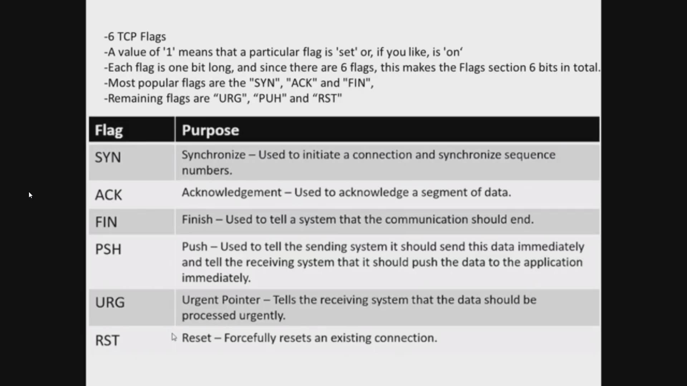

🔴 Scanning techniques are built on top of these TCP flags, wireSharp -> `sniffing tool` && `network monitoring analyzer`, uses them 🔴 and it tells everything we learned about segments, packets, sockets, syn msgs etc...

Even DoS, PDoS are related to this, but with knowing `sequence number`, `stateful firewall` ,and `open ports`

Check this full open session: 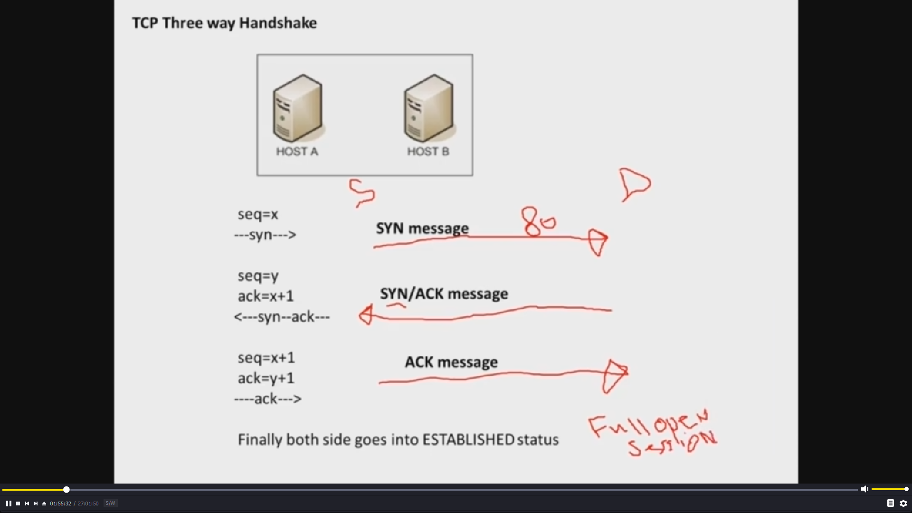

a vulnerability is that when client sends syn msg, and host res with syn/ack msg, host waits for ack! `type of DoS attacks are playing on this, changing the S ip on each third step! half open session`

seq is seq++ on each handling, ISP uses windowing on this to lower internet speed!

stateful/stateless firewalls:

* stateless => preventing data via: source destination, ip addrs, port #, S dest, protocol type!
* stateful = stateless + logging data!

Stateful firewalls can view the MITM (man in the middle) attacks, via these logs!

as when transmitting data is finished a:b using FIN flag, then MITM attacker tries with it, it says no, because I got fin and sent fin-ack

### Microsoft AD, GPO

using windows server as v2012, it works to make local windows machines act as servers with their domain

```sh
domain
baderidris.com

DC1 => domain controler # has role of AD DC => active Dir Domain Service, defaults to have DNS aside to it
pc1.baderidris.com
user bader password secret

# the AD is a database to have roles, fields are called forests, in NTDS/ntds.dit file
```

there's a loophole in saving users data in that pc1 machine with windows server OSs, because it saves them with 10 tries as a backup to losing connection with the domain, it'll have `SAM && ntds.dit` copies, Default behavior

users are called `Object`s, role == class, privileges == attributes

creating another user in the same forest, is called tree

Finished day 0, 2:17:50 : 27H 😱

## day 1 CEH concepts

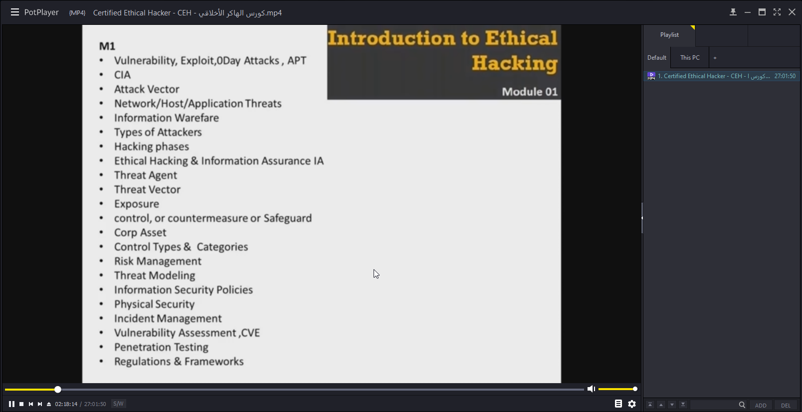

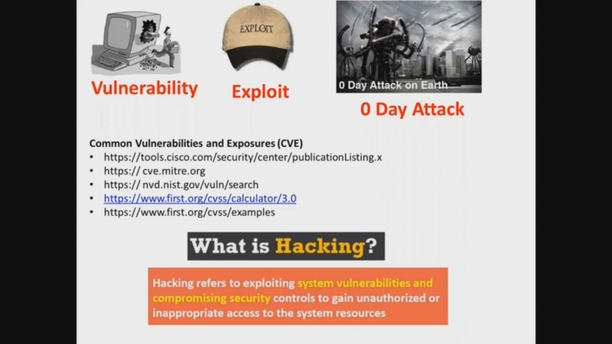

unknown attacks are considered 0 day attacks!

majority of vulnerabilities are measured with `Common vulnerability Scoring System` CVSS calculator of their severity.

Types of attacks:

* OS Attacks
* Misconfiguration Attacks
* Application Level Attacks
* Shrink wrap code Attacks

These are the core objectives of security:

* Availability
* Integrity
* Confidentiality

> We need to protect hardware, software and stored data!

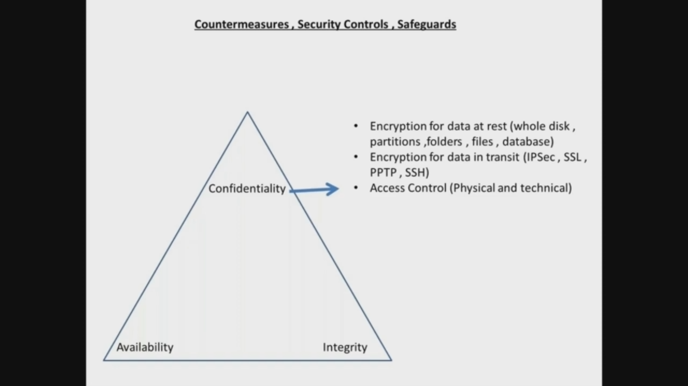

Integrity is used too much by programmers like me: DevOps and backend Engineers! as in hashing passwords, encrypting data, etc...

Availability contains: load balancing, multi-nodes, backups, RAID modes also used in my backend industry.


70% of attacks occur because of internal weaknesses, and 80% of hackers are script kiddies, boys who copy some steps and tries them out!

That's why tutor's saying kali is for script kiddies, because professionals use specific tools to their needs!

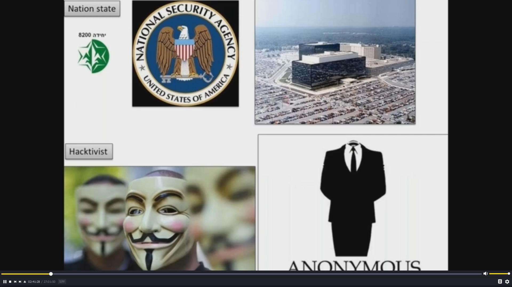

Check [defCon](https://defcon.org/) website for hacking resources

### Hacking phases

1. Reconnaissance
2. Scanning
3. Gaining Access
4. Maintaining Access
5. Clearing Track

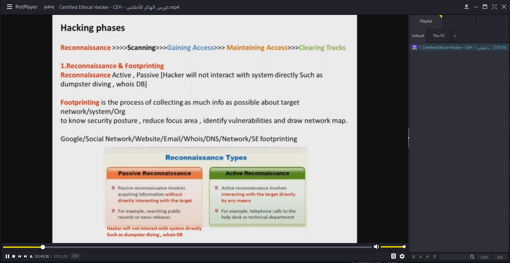

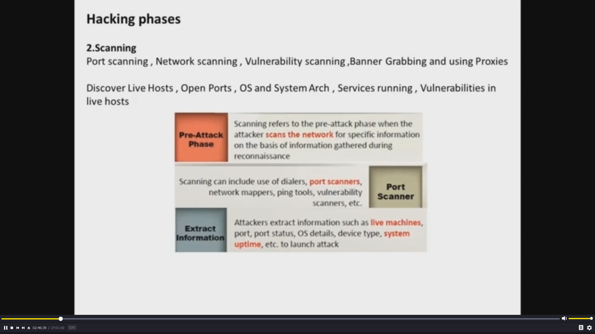

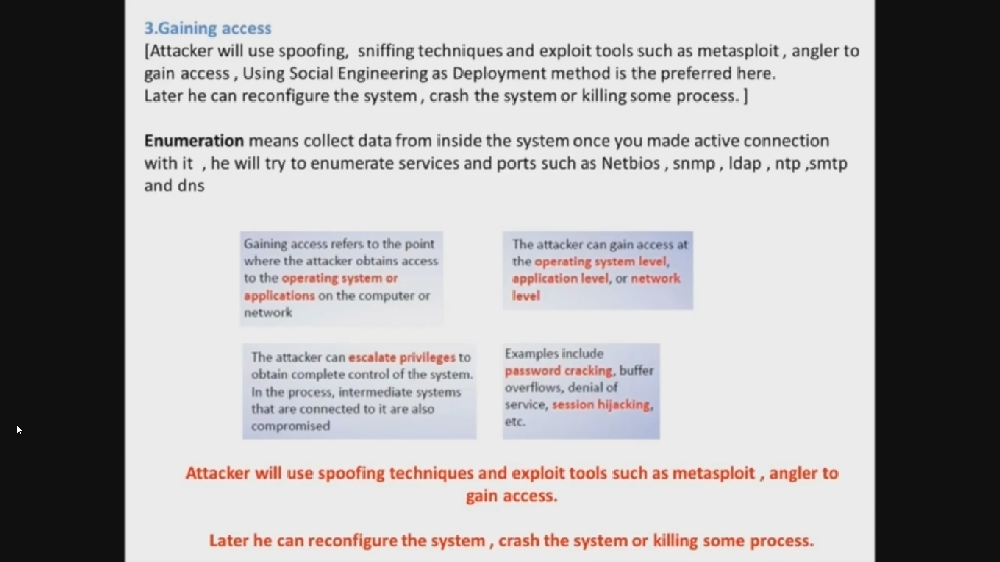

Enumeration happens in phase 3, not as hackTheBox started with, They are using CH school curriculum, that's why they started in Enumeration!

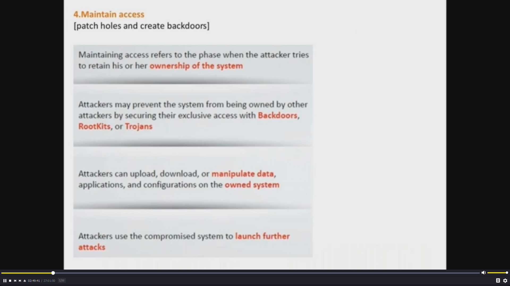

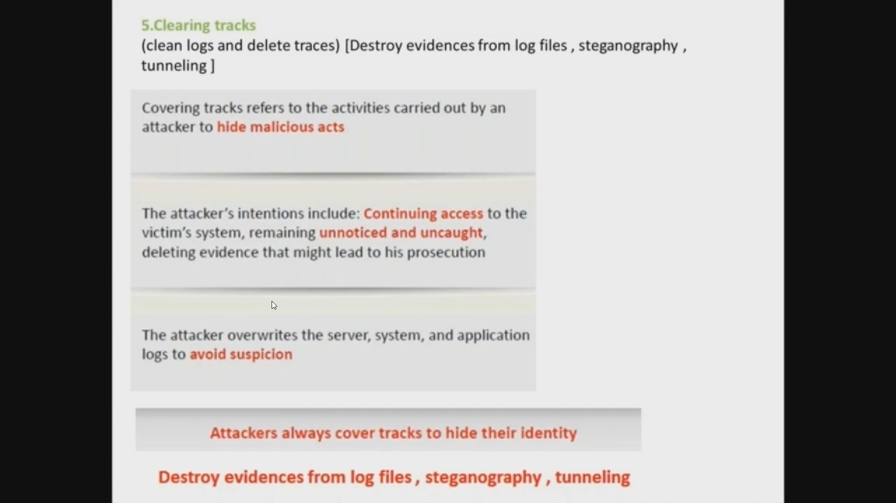

🔴 Those 5 phases are from `EC council`, another school is `The cyber kill chain` naming the phases with other naming. 7 steps! 🔴
