# CEH intro

## **Day 0**.

requirements are, familiarity with:

* VMs
* linux && bash scripting
* Kali and its disrto siblings
* linux metasploitable
* OSI Model & TCP-IP
* Microsoft AD, GPO

### VMs

because I know about them, they're addition layer with isolation and modification of an entire os above the exiting one!

### linux OS && bash scripting

You'll need to take system administration course to master these important concepts, and shell scripting bash, another course!

```sh
ifconfig # more advanced than ping
# as with
ifconfig eth0 {target_ip} # or even more as
ifconfig eth0 {target_ip} netmask {255.255.255.0} # changing its ip

ifconfig eth0 down # to stop it
ifconfig eth0 up # to start it
```

to add a default gateway, use:

```sh
route # check next one
route add default gw 192.168.3.2
```

To use a specific DNS server:

```sh
echo nameserver 8.8.8.8 > /etc/resolv.conf
```

to check existing shells, use: `cat /etc/shells`

### kali and its siblings

These are derived from unix based systems building hacking tools, some are specified to offensive security, others to defensive sec, we can say: check red, blue, black, white hats for this!

### metasploitable

metasploitable is the environment to penetration testing, filled with loopholes

they use the term `boot-to-root VMs`, a bounty to access the root after booting

### OSI Model & TCP-IP

the seven layers of networking machines, **OSI Model**:

1. Physical
1. Data link
1. Network
1. Transport
1. Session
1. Presentation
1. Application

**TCP-ip** is the shortened term (protocol) you saw in byteByteGo:

1. Network access
1. Internet
1. Host-to-host
1. Application (latest 3 layers combined)

> Tutor's ordered them in descending order.

Layer 7 `Application` is not the applications we use, it's the base of protocols that handles the apps, http?s, ftp?s ssl/tls, dhcp, snmp, telnet, tftp=>`as .env files`, etc...; aka: `Services protocols`.

Layer 6 `Presentation` formatting files and their extensions, `extensions are protocols!`

Layer 5 `Session` handling data between notes, as with `RPC`, `VNC`.

Layer 4 `Transport` 7th layer can't do its jobs without these two protocols of transport: `TCP/UDP`, http => tcp; in this layer we chunk data into `segments` and attach `header` to each, which is `TCP/UDP` header, headers include two important parts, source port Number => **S port#** && destination **D port #**. eg: `d port# 80`, `s port#60000` s as random of 16b => 2^16, 0-1023 => *well known ports*, `ip add + port number = socket` as `255.255.255.255`, it can be found in `C:\Windows\System32\drivers\etc\services` windows, it contains good data of ports!

Layer 3 `Network` here we send many sockets in one packet, each packet has a header with network protocol named `IP`, each header also has S/D ports, meaning, inside each socket and each outer Packet, packets => `S IP Address, D IP Address`, if services file contains 2 versions, IPv4, IPv6 for a host, it'll format to IPv6, as localhost: `127.0.0.1` to `::1`

Layer 2 `Data Link` all prior data is contained to `frame`s, based on the type of network, eth has mac Addr, each frame has a header, & a tail, tails have: `CRC` checks data scale/length with `MTU` => *maximum transition until* tutor's said it's 1500 byte, 1.5Kb to most interfaces. similar to checksum but checksum is in each header, in each layer, and checksum checks header's status. frames have in headers: `S MAC, D MAC` s/d mac address, written in HEX, 12 hex, in bits 48, Physical addr === mac addr, as `00-15-5D-EA-60-B5` 12hex, first 4 sets, `00-15-5D` represents the manufacture company = `vendor/OUI`, others for the machine, asking `IANA` to register these MAC addresses, [check this](http://www.iana.org/assignments/ethernet-numbers/ethernet-numbers.xhtml), to get the Destination MAC, we go to layer 3 and get `ARP`, there are other protocols in l3: `IGMP`, `ICMP`, ARP should get data from both packet & Frame to bring the D mac, `if we poison this ARP in pc's files as in arp -a we can do man in the middle attack`

Layer 1 `Physical` converting data into bits to compute them, academically, they call each layer's data as `protocol data unit PDU`

---

TCP has 6 common flags commonly used, to do tcp `three way hand shake`


🔴 Scanning techniques are built on top of these TCP flags, wireSharp -> `sniffing tool` && `network monitoring analyzer`, uses them 🔴 and it tells everything we learned about segments, packets, sockets, syn msgs etc...

Even DoS, PDoS are related to this, but with knowing `sequence number`, `stateful firewall` ,and `open ports`

Check this full open session: 

a vulnerability is that when client sends syn msg, and host res with syn/ack msg, host waits for ack! `type of DoS attacks are playing on this, changing the S ip on each third step! half open session`

seq is seq++ on each handling, ISP uses windowing on this to lower internet speed!

stateful/stateless firewalls:

* stateless => preventing data via: source destination, ip addrs, port #, S dest, protocol type!
* stateful = stateless + logging data!

Stateful firewalls can view the MITM (man in the middle) attacks, via these logs!

as when transmitting data is finished a:b using FIN flag, then MITM attacker tries with it, it says no, because I got fin and sent fin-ack

### Microsoft AD, GPO

using windows server as v2012, it works to make local windows machines act as servers with their domain

```sh
domain
baderidris.com

DC1 => domain controler # has role of AD DC => active Dir Domain Service, defaults to have DNS aside to it
pc1.baderidris.com
user bader password secret

# the AD is a database to have roles, fields are called forests, in NTDS/ntds.dit file
```

there's a loophole in saving users data in that pc1 machine with windows server OSs, because it saves them with 10 tries as a backup to losing connection with the domain, it'll have `SAM && ntds.dit` copies, Default behavior

users are called `Object`s, role == class, privileges == attributes

creating another user in the same forest, is called tree

Finished day 0, 2:17:50 : 27H 😱

## day 1 CEH concepts


unknown attacks are considered 0 day attacks!

majority of vulnerabilities are measured with `Common vulnerability Scoring System` CVSS calculator of their severity.

Types of attacks:

* OS Attacks
* Misconfiguration Attacks
* Application Level Attacks
* Shrink wrap code Attacks

These are the core objectives of security:

* Availability
* Integrity
* Confidentiality

> We need to protect hardware, software and stored data!


Integrity is used too much by programmers like me: DevOps and backend Engineers! as in hashing passwords, encrypting data, etc...

Availability contains: load balancing, multi-nodes, backups, RAID modes also used in my backend industry.

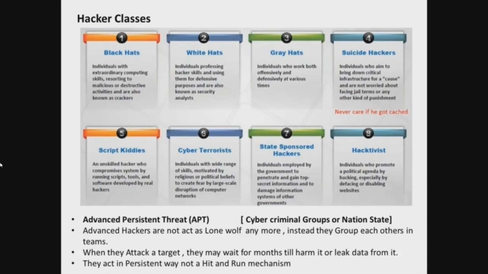

70% of attacks occur because of internal weaknesses, and 80% of hackers are script kiddies, boys who copy some steps and tries them out!

That's why tutor's saying kali is for script kiddies, because professionals use specific tools to their needs!


Check [defCon](https://defcon.org/) website for hacking resources

### Hacking phases

1. Reconnaissance
2. Scanning
3. Gaining Access
4. Maintaining Access
5. Clearing Track


Enumeration happens in phase 3, not as hackTheBox started with, They are using CH school curriculum, that's why they started in Enumeration!


🔴 Those 5 phases are from `EC council`, another school is `The cyber kill chain` naming the phases with other naming. 7 steps! 🔴

> What's ethical hacking?

And what's IA => information assurance, it's the process of assuring the integrity, security, confidentiality and authority of data are protected during: `usage`, `storage` and `transmission`!

We do it by conducting:

* Risk Management
* Policies
* Physical Security
* Pen Testing
* Performance Certification && accreditation
* Training && awareness

Then using containerization and Certbot with my application is of these approaches!

---

Security Control types:

* Technical (Logical) Control
* Administrative (Soft) Control
* Physical Control

each of these three provide 7 different Fns || types:

1. Preventative controls
1. Detective controls
1. Corrective controls
1. Determent controls
1. Recovery controls
1. Compensative controls
1. Directive controls [Regulations]

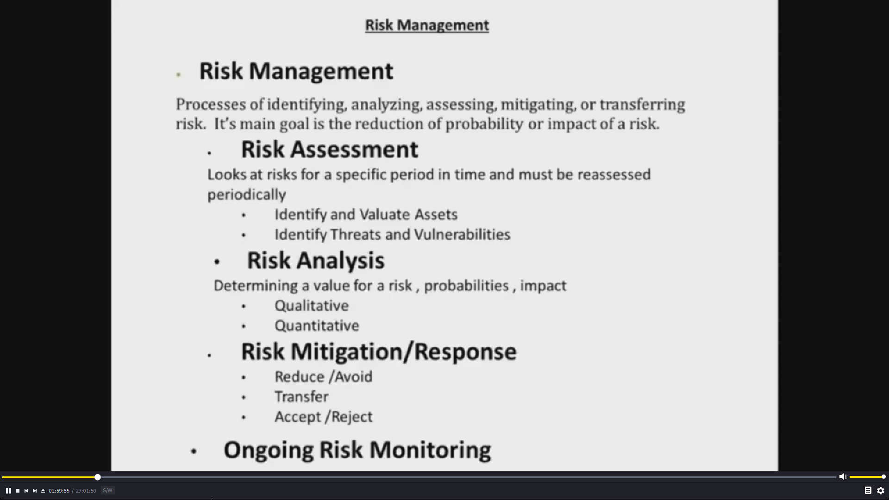

One of the important Risk Assessment tools: `Threat modeling`, and the best app for it as tutor's said: `microsoft threat modeling`, it's a good drawing tool, with predefined icons of OS. similar to the new `SNYK` tool

tangible and non-tangible assets, and their risks of being lost, that's the measuring of risk management


An important concept to measure how risky are the threats and even the value of the company itself.

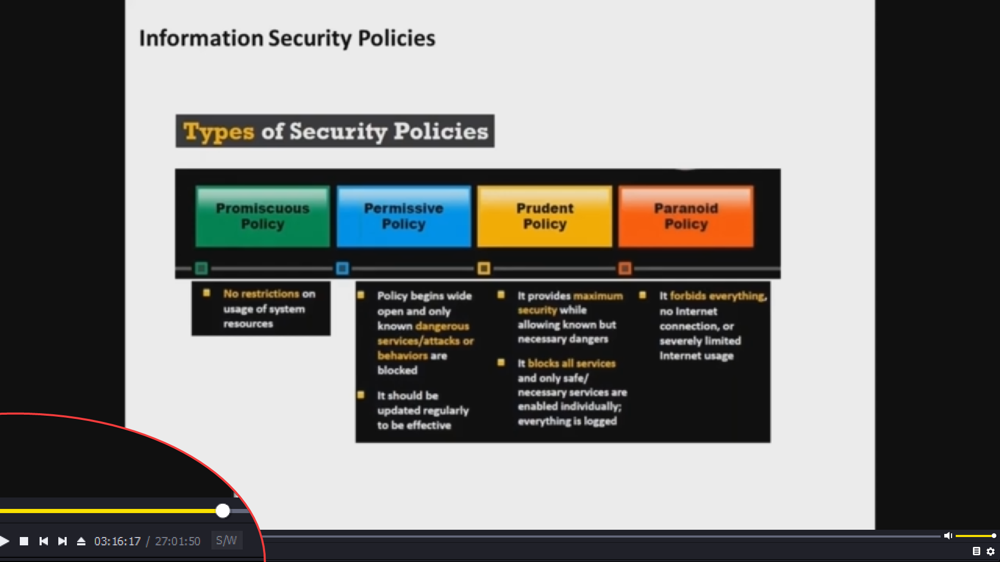

Some military policies follow Paranoid Policy, which forbids everything!

a good resource for examples of these security policies [is:](https://www.sans.org/information-security-policy/) `sans.org` it contains PDF files on each topic.

Some payment policies good to be in our app is as `PCI-DSS` to have the credentials to our costumers! This is in `Regulation` section!

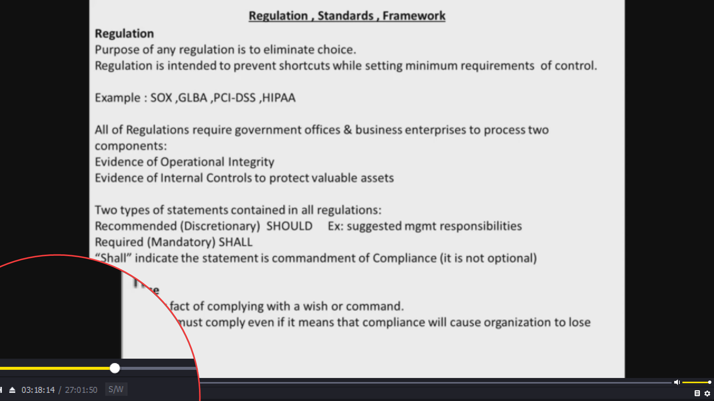

BHI and BII are good to look up for business regulations!
Also Check for AUP => `Applicable Use Policy`, when we ask uses to accept our terms.

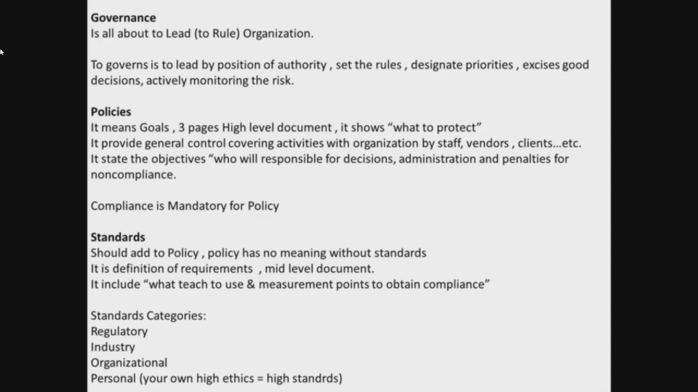

> *Compliance is Mandatory for Policy*

Guidelines

Its general instructions , its Discretionary , its Do that & Not that.
Its advices for how organization objectives might be obtained.
Its has no meaning without adding to it Procedures.

**Procedures**

Its How-To instructions for success.
Its details written in **Step-by-Step** format.
It include "Best Practice" suggested to develop your own procedures.

Compliance is Mandatory for procedures

These topics are all important in the CEH exam!

incident management

Incident management is a set of defined processes to identify, analyze, prioritize, and resolve
security incidents to restore normal service operations as quickly as possible and prevent future
recurrence of the incident.

## Module 2 footprinting && Reconnaissance 3:26:40

| # | Footprinting Methodology |
|---|-------------------------|
| 1 | Footprinting through Search Engines |
| 2 | Footprinting Using Advanced Google Hacking Techniques |
| 3 | Footprinting through Social Networking Sites |
| 4 | website Footprinting |
| 5 | email Footprinting |
| 6 | Competitive Intelligence |
| 7 | WHOIS Footprinting |
| 8 | DNS Footprinting |
| 9 | Network Footprinting |
| 10 | Footprinting through Social Engineering |

### 1 through Search Engines

check these web applications for foorprinting:

* spiderFoot
* ShowDan
* cenSys

A great thing about the 2nd/3rd ones, is that they try as possible to appear the stack of targeted site!

### 2 Using Advanced Google Hacking Techniques

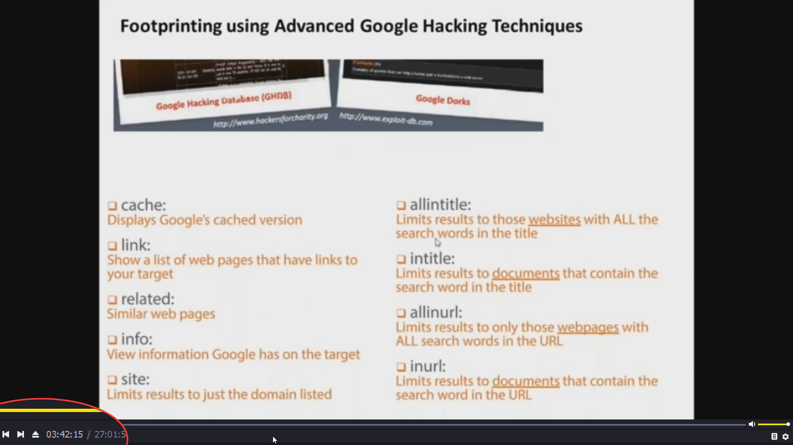

examples:

Some people misuse their cameras, so we can find them using advanced searching as in google: `intitle:webcam7 inurl:8080 -intext:8080`

> check Google hacking penetration testing Book

### 3 Footprinting through Social Networking Sites

Kali developers: offensive security, have [exploit database](https://www.exploit-db.com/google-hacking-database) they put latest data on tips of google advance searching 🔴

### 4 website Footprinting

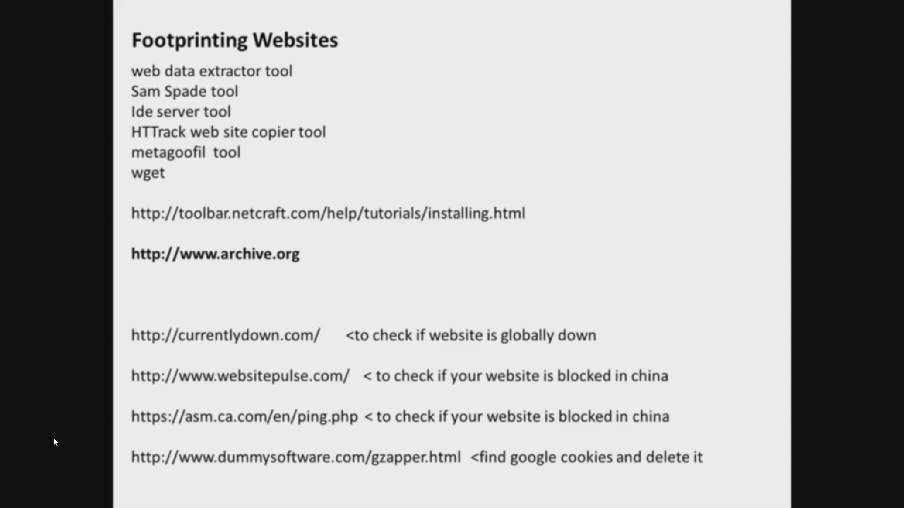

most of the websites are preventing web scramming, so this technique is not that useful nowadays

### 5 email Footprinting

Open the source of the sent email, focus on email header

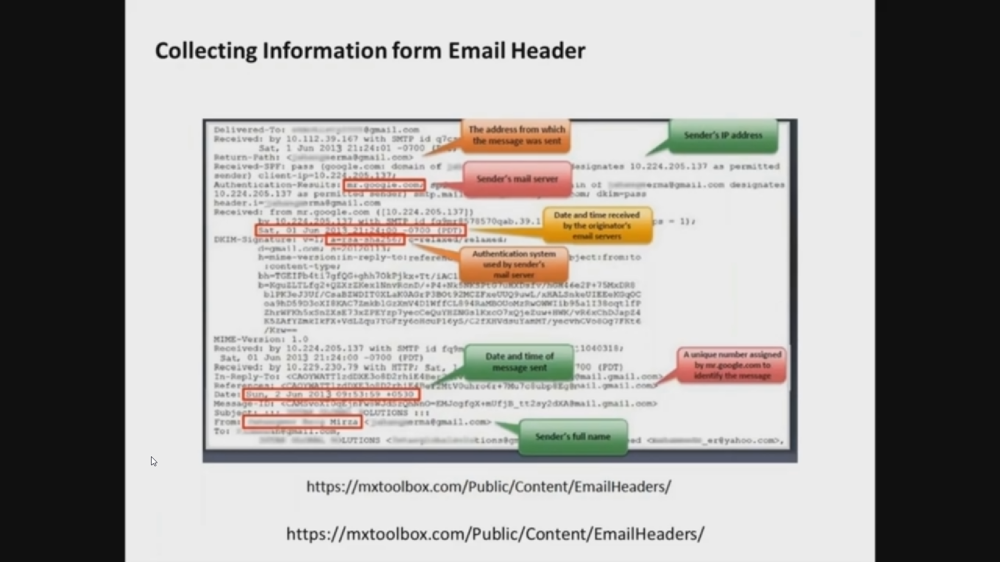

Another good resource for it is: `ip2location.com`, also `ipLocatdion`, `email tracker pro`

### 6 Competitive Intelligence

Tutor passed it

### 7 WHOIS Footprinting

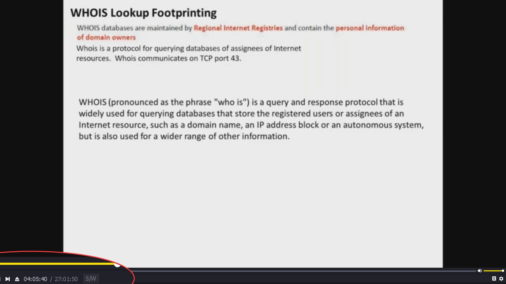

### 8 DNS Footprinting

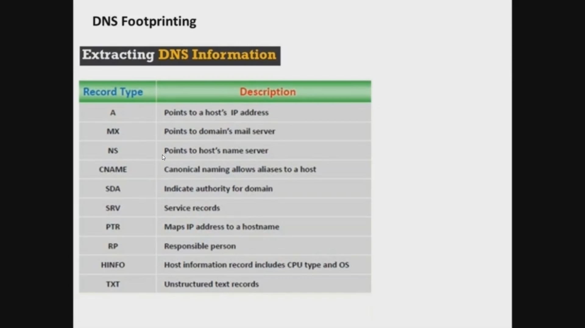

good tools for it: `dig` => domain information groper, `nslookup` and `host`

### 9 Network Footprinting

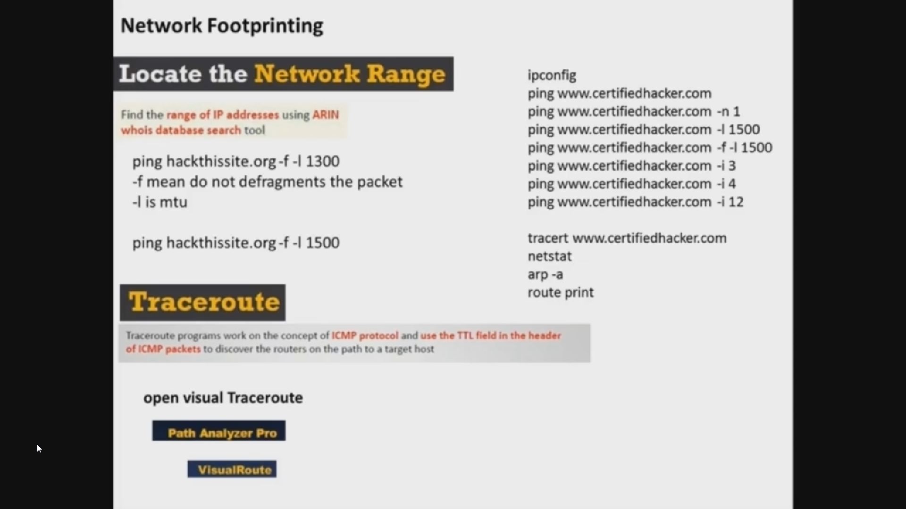

### 10 Footprinting through Social Engineering

watch catch me if you can to get it, some tools `maltego`

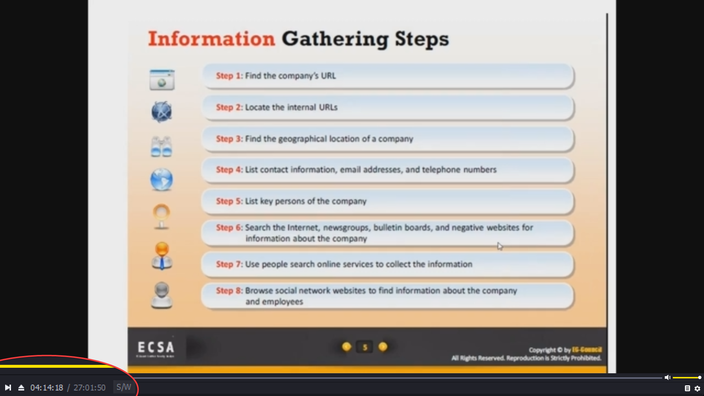

32 steps, specified for pen testers

## practical footprinting 4:34:00

an important tool for doing footprinting is `host`

```sh
host --help

# some networking fixes:
ifconfig eth0 up
ifconfig eth0 192.168.3.128/24 # <check-options>
route add default gw 192.168.3.2 # check it out
ping 8.8.8.8
## >>------------------------<<

host -t mx darkmatter.ae
# the pick one of its domains, then
host -t a mx3.zoho.com # host -t a <domain>
# this will provide website's ip
host -t ns darkmatter.ae # ns -> name server
# to check if they have IPv^ add aaaa
host -t aaaa darkmatter.ae
```

Another good command is `theharvester`, for same purpose

```sh
theharvester -d darkmatter.ae -b google > smFile # -d => domain, -b dataSource
```

Another great tool for checking load balancing is: `lbd`, for many levels, it might get the 7 lvls explained in system design book

```sh
lbd microsoft.com # or > smFile
lbd microsoft.com > smFile
```

An important to understand the framework of metasploit is `recon-ng`

```sh
# starts with >
recon-ng
workspaces add SM_Name # to redirect from default one
workspaces list # it uses SQL db
workspaces select SM_Name
help
show modules # to get all listed modules/Fns
use recon/domains-vulnerabilities/xssposed
show options
# here we need to change its value, because it defaults to default for domains
set SOURCE cbtme.com
show options
run # important for cross site scripting checking
# to go back use this, not c^z or c^c
back

add domains darkmatter.ae
add domains www.darkmatter.ae

show domains
use recon/domains-contacts/pgp-search
show options
# we can run, it'll sue the two set domains above
run
# it'll try getting emails from that app
load reporting/json

set CREATOR bader
set CUSTOMER DM
set FILENAME ~/Desktop/reporting.json
run
```

we can also use `dig` to view some good details about servers

```sh
dig cbtme.com A
```

## Module 3 Scanning Networks 5:02:00

Objectives of Network Scanning!

* To discover live hosts, IP address, and open ports of live hosts
* To discover operating systems •nd system architecture
* To discover services running on hosts
* To discover vulnerabilities in live hosts

Scan types

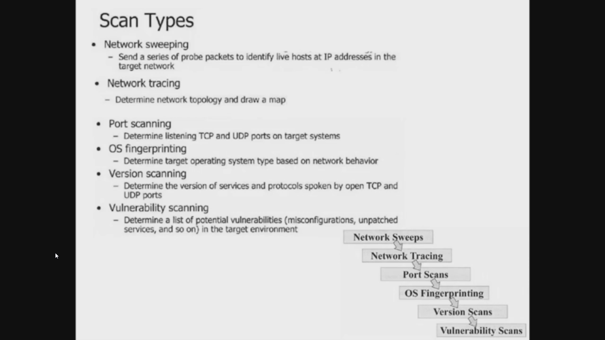

two important tips, `scan ips` & `run a sniffer as wireShark`

three tools to do TCP manipulation/creation: `colasoft` `scapy` `Hping`

