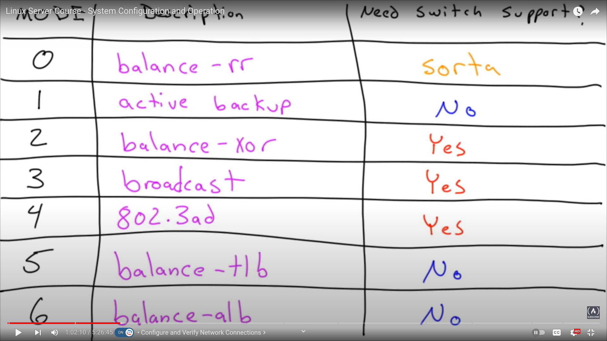
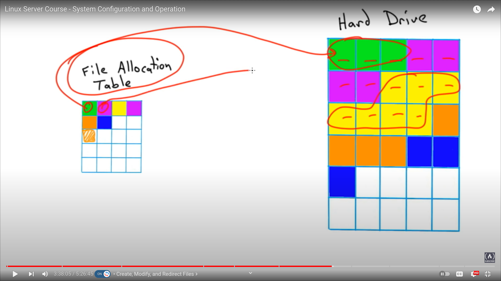

# Linux Server Course - System Configuration and Operation

This course is advanced and provided from free code camp Co, check its url [here](https://www.youtube.com/watch?v=WMy3OzvBWc0),**This course will teach you how to configure servers running the Linux operating system, including the boot process, kernel modules, network connection parameters, and localization groups.**

⭐️ Course Contents ⭐️
(0:00:00) Introduction
(0:00:34) Explain Linux Kernel and Boot Concepts
(0:37:20) Configure and Verify Network Connections
(1:17:13) Manage Storage in a Linux Environment
(2:12:18) Install, Update, and Configure Software
(2:32:40) Manage Users and Groups
(3:02:32) Create, Modify, and Redirect Files
(3:51:20) Manage Local Services
(4:16:40) Summarize and Explain Server Roles
(4:49:50) Automate and Schedule Jobs
(5:06:30) Explain and Use Linux Devices

Tutor: [Shawn Powers, CBT Nuggets](https://www.youtube.com/user/cbtnuggets)

## Explain Linux Kernel and Boot Concepts

BIOS => basic input and output

UEFI => Unified Extensible Firmware Interface

BIOS has MBR => master boot record, in the very first sector (boot sector) of the hard drive.

With bios and mbr we can only have 4 partitions, there are workarounds it though.
Size can only be 2TB with bios.

In uefi, there is a secure boot which isn't avaiable in bios

**there are hacks to get around limitations when having bios machines as mine**.

### Grub vs Grub2

grub stands for GRand Unified Bootloader

they both boot the system, grub 1 is often called grub legacy.

you can check which grub version is installed by going to `boot grub folder`, which is `/boot/grub` if you see `menu.lst` or, `grub.conf` it's v1, but v2 comes with: `grub.cfg`

> I found this on the internet: `grub-install --version`.

in v2, we can easily modify booting process from this file: `/etc/default/grub`

v2 can identify hard drives based on uuids. or other advnaced than v1.

v2 is normally hidden, so you need to hold on the `shift` to show it off.

after modyifing `/etc/default/grub` file we do have to use

```sh
sudo update-grub
```

### linux boot methods

There are many flexible methods to boot linux.
it can boot from `PXE`, `USB`, `CD`, `iPXE`, `ISO`

PXE => `Preboot eXeCution Environment` boots completely over the network!
we can boot iso even before burning the file to a hard drive.

> exe uses ip and a boot file from a DHCP server to boot the system.

iPXE downloads the boot file using http instead of tftp.

The actual linux kernel file name is: `vmlinux or vmlinuz` z is compressed.
But it needs other modules, not only the basic file!
modules are as keyboards, mice, speakers etc...

To see where are the modules (mice keyboards) we can go to the `/lib/modules` folder. which is primary found in `/boot/System.map*` file,
`initrd` is like the staging area of prior to booting.

### kernel panic

Common causes of kernel panics:

1. over clocked CPUs, memory issues, add-on cards eg: GPUs
2. upgrading system
3. Hard Drive Failure

With upgrading kernel panics, when it boots up, we can go to grub and `pick an older kernel`, we go to advanced options then picking up an old version of our ubuntu options => `kernels`!

### automating kernel modules && blacklist some

the file `/etc/modules` is responsible for loaded modules at boot time, for instance the `e1000` is for intel network card modules!

It's smart that if a modules depends on another, it'll load both, but by default if there's duplication, it'll only load the first as it's a scripting language.

Check `/etc/modprobe.d/blacklist.conf` which is the path to blacklisting forbidden modules.

Blacklisting is important to prevent many bugs.

### manipulating kernel modules

modules are great for not wasting the ROM with unused devices, and that is memory efficiency

There are good tools to manipulate these modules:

* insmod
* modprobe
* depmod

`insmod` => very basic program that requires

1. path only => full path of to install kernels
2. no deps checking
3. fail with no explanation

`modprobe` on the other hand is a more advanced application, it's like a scientist in the lab.

You only give it the kernel module name, and boom!
It'll check all deps and will load other deps on modules if needed.

It needs us to have a map for needed independencies.
but there are solutions to that!

why to care about `insmod`, because `modprobe` uses it behind the scenes.

#### practicing

```sh
cd /lib/modules/
ls # to check currently running kernel
cd <kernel-as-6.5.0-18-generic>
# we'll see map files for our modprobe
cd kernel
ls
cd drivers
cd net # that's a lot, really a lot
# we can use the insmod here
insmod <full-path-to-driver> # it'll throw an error
# here comes the professional modprobe!
modprobe <driver-name> # no full path required, it'll install it automatically, as if no errors were thrown
lsmod # to see all installed modules
rmmod <driver-name> # to remove a module

# if we install a new kernel module downloading a piece of hardware, we need to update the system map with:
depmod
```

## Configure and Verify Network Connections

Always check the cables, and hardware issues before CLIs. to not get frustrated

Quick tools to determine what issues we have:

1. ping
2. ip add

```sh
# let's say the browser doesn't work with google.com
ping google.com # this checks its connectivity
# if unreachable, we might use their ip connected to DNS
ping 8.8.8.8 # <google's-ip> if it works, it'll be a DNS issue!
# if not, it'll more than a DNS issue, we can use some tools
ifconfig # install it if not installed with:
sudo apt install net-tools

ip add # provides network ip addresses
# we can ping our eth0 with inet <ip-addr> as
ping 192.168.1.176 # for my local network, not the virtual one: 127.0.0.1
```

If we can connect to other computers but not the internet we can use these tools:

```sh
ip route
# we need to have a default route set, mine is 1st line as:
default via 192.168.1.1 dev enp1s0 proto dhcp src 192.168.1.176 metric 100
```

A fast solution that might work is to turn off => on the network cable.
Another approach is to use the bottom of turn off => on the network interface.

We should put ourselves in the place of a packet to follow each step and trouble shooting it.

### checking/testing DNS

tools to test 'em

* ping <tended-DNS-server>
* dig <tended-DNS-server> # as dig google.com
* nslookup <tended-DNS-server>
* host

with dig, we also can search for their server with `@` as `dig @8.8.8.8` for google.com, tutor: `dig @server host`

Other tools just use different order:

```sh
nslookup host server
host host server
```

using dig google.com, tutor got curious about SERVER, under query time:

```sh
;; Query time: 20 msec
;; SERVER: 192.168.1.1#53(192.168.1.1) (UDP) # it's basically the default server
;; WHEN: Mon Jul 01 15:36:09 EEST 2024
;; MSG SIZE  rcvd: 83
```

using `nslookup google.com`:

```sh
# a little different format
nslookup google.com
<<checkIt
Server:         192.168.1.1
Address:        192.168.1.1#53

Non-authoritative answer:
Name:   google.com
Address: 172.217.171.206
Name:   google.com
Address: 2a00:1450:4006:803::200e
checkIt
# they were about to deprecate it, not didn't 😐
```

lastly, we have `host tool`

```sh
host google.com
<<provides
google.com has address 172.217.171.206
google.com has IPv6 address 2a00:1450:4006:803::200e
google.com mail is handled by 10 smtp.google.com.
provides
# doesn't provide default server being used!
# some commands require flags in my 24 version to have same as my tutor!
```

The tutor prefers using `dig`;
Check this: `dig @8.8.8.8 google.com`

he went to the extra `/etc/hosts` file to trouble shoot a hosting issue!
after finding an issue with `ping google.com` which was a wrong ip added to the file!

### locating different network config files

* /etc/hosts
* /etc/resolv.conf
* /etc/nsswitch.conf

there are a few differences when it comes with different distributions as with debian & ubuntu, but mentioned ones are common in all distributions

> to modify these files, we have to be root to do it.

```sh
sudo su - # I see some people do sudo -i
vi/nano /etc/hosts
# this is the first resort file for DNS lookup!
# in the file, we can prevent people from accessing let's say google
# by referring it to a local server, as:
127.0.0.1 google.com
# try doing it in a browser, it'll throw an error: unable to connect!
```

The other file we're talking about is: `/etc/nsswitch.conf` which contains many configs, passwds group files, and DNSs

Check it's `hosts:` line

```sh
# if the hosts: line is as:
hosts:          files mdns4_minimal [NOTFOUND=return] dns
# it means that the file it's gonna read/query is `/etc/hosts`
# 🔴 the other characters are options, meaning: these are arguments and files is the first option it'll query 🔴
```

Now to the `resolv.conf` file, it's a big of a confusing file, it has `nameserver 127.0.0.53`, my version doesn't have same data, maybe it's deprecated! tutor's file says: `don't edit`

Network manager handles all this for us, but it's useful to know what server your machine is using, look in here! `/etc/resolv.conf`

### some differntiations between debian and ubuntu config files

To know our current os version, we use: `cat /etc/os-release`

```sh
# view mine:
cat /etc/os-release

<<info
PRETTY_NAME="Ubuntu 24.04 LTS"
NAME="Ubuntu"
VERSION_ID="24.04"
VERSION="24.04 LTS (Noble Numbat)"
VERSION_CODENAME=noble
ID=ubuntu
ID_LIKE=debian
HOME_URL="https://www.ubuntu.com/"
SUPPORT_URL="https://help.ubuntu.com/"
BUG_REPORT_URL="https://bugs.launchpad.net/ubuntu/"
PRIVACY_POLICY_URL="https://www.ubuntu.com/legal/terms-and-policies/privacy-policy"
UBUNTU_CODENAME=noble
LOGO=ubuntu-logo
info
```

Tutor says: 16v in 2021 was a valid version to use in production!

In that version, to configured into this file: `/etc/network/interfaces`

> But in modern versions, 18.04+v it uses a completely different network config system!

new versions use: `/etc/netplan/<a-variant-file>.yaml`

If we modify that file, we'll have to use this command to update it: `sudo netplan apply`

There is another cmd: `sudo nmtui` which is: network manager text UI.

So, we're having two ui options, the first one is gui, and the second one is text ui.

### network distribution options

even with the greatability of using debian distributions and its best one: ubuntu, tutor says: `centOS` or `red hat` have really have elegant solutions for how to configure the network and their both text ui and gui are smooth and easy to use, **not confusing**!

### network bonding modes

if our server has 3 Ethernet wires, and they're supplied to a switch, the we can bond the 3 ports together in 1 port.

Two kinds of network bonds to use:

1. switch support
2. generic

there are many choices, 

Switch support has many names, layer 3 switches or smart switches or `link aggregation` LLCP or either channel, the idea is: **a smart switch will have built-in code'll allow them to work together**

#### bonding modes 1:02:xx

* 0 balance-rr (round robin, mode 0)
* 1 active backup
* 2 balance-xor
* 3 broadcast
* 4 802.3ad
* 5 balance-tlb
* 6 balance-alb

balance-rr requires is a sorta requiring switch support, because plugging it into a switch requires switches whose supports `link aggregation`

If you're connecting two computers without a switch, you don't need to have switch support with `0 balance-rr`.

second one, active backup relies on one switch, if it fails, another will connect, it doesn't require switch support because it only uses one port.

`balance-xor` requires switch support, but it's better using the **industry standard link aggregation protocol** `802.3ad`, meaning, if you're able to use this, don't and use the `mode 4` because, the switch knows what to do, the plugin knows what to do, and it's a smart way of increasing throughput, availability, fault tolerance.

we only use `broadcast` in a very specific case, it takes all ports and spues all of the data out all of the ports at once

What we need to focus on, are the bottom 2. `balance-tlb` => **balance transmit load balance**, and `balance-alb` => **all load balance**

`mode 5 tlb` transmits which ever port is currently the least busy

`mode 6 alb` is basically similar but on both I/Os not only to output data as prior one.

it consistently changes the mac address on its ports. he used it in prod for years and had never had a problem. with dumb switches that are available for 60$ in Amazon.

Summation: using mode 4 when having switch support `link aggregation`, when not using mode 6 is the best. if connecting two servers with multiple ports, mode 0 is the fit.

### configuring network bonds 1:08:15

configuring bonds is easy when you know which to pick, let's practice that:

```sh
# ubuntu:
cd /etc/netplan
ls # to view our variant.yaml file
nano <yaml_file.yaml>

# an example of the file
network:
  version: 2
  renderer: networkd
  ethernets: # we do have to define eth cards
    eth0:
      dhcp4: false # beause we don't wanna asside address to eth0
    bonds:
      bond0: # its name
        dhcp4: false # because it's a static ip add
        interfaces:
          - eth0 # it should be more than 1
        addresses: [10.10.10.10/24]
        gateway4: 10.10.10.1
        parameters:
          mode: active-backup # this is important, mode 1
        nameservers:
            addresses: [8.8.8.8]
# after saving the file, we do
netplan apply
# to check if it's working, do
ip add
# or viewing a virtual file system proc
cat /proc/net/bonding/bond0
# check its bonding mode, etc
```

then tutor's explaining how to config it in centOS, in 1:10:00

but it uses the term master/slave in the process, which is kinda interesting!

### understanding GPT && MBR

These are two different ways of taking a hard drive and chapping it up into pieces, so these pieces can be recognized and mounted as different drives on the OS.

`GPT` is much newer and much more feature rich than the old school `MBR`.

We'll talk about `protective MBR`, and differences between MBR and GPT.

MBR => `master boot record` -> BIOS
GPT => `GUID partition table` -> UEFI

GUID => `Global Unique Identifier`

MBR, when it's defined we can chop it to 4 pieces, and each piece can have 4 pieces!

GPT, has crc correction to get better fault tolerance.
And it can use much bigger drives, like 32TB, or even Petabytes, but its sibling -> MBR can only handle 2TB

But an interesting thing, is that **bios systems can still see GPT drives**.

Because chopping the starting point of the drive, is similar in its mechanism.

And with protective MBR, BIOS can deal with GPT drives.


## Manage Storage in a Linux Environment

Linux file system is cool because it all -modules and components- goes to one file of its hierarchy, even **network mounts in its one big one**.


To make changes to the currently running kernel, we go to either of `/proc` and `/sys` dirs. `virtual file systems`

the whole `/home` could be a network mount, using remote NFS. => `network file system`!

There is a great tool to install which is `tree` that you can use to see the hierarchy of your file system.

You can even put a network file system in one of those hierarchies, meaning: a network mounted dir as any other dir, **it doesn't appear easily as a NFS**, thats' awesome!

```sh
tree ~/Downloads
/home/bader/Downloads
├── RabbitMQ in Action ( PDFDrive ).pdf
 │   └── zh-TW
    │       ├── bootmgr.exe.mui
    │       └── memtest.exe.mui
    └── bootmgr
# it's lovelier than this.
```

Using `..` in paths, we can even chain it, as: `cd /path/child/../child2`, this goes to parent as `..`, then goes to a siblings again in same command!

> `Tilta` is a shortcut to `home` dir, `~/`

use this:

```sh
cd ~ # or ~/
pwd
# it'll appear the home, mine is:
/home/bader
```

### creating/manipulating partitions

we'll use some good tools to do so:

* parted/gparted
* fdisk
* info tools

Approahces to interact with drivers, 🔴 IMPORTANT 🔴
```sh
lsblk # to check our hard drives
# fd0 => floppy disk, which isn't always correct, it could be a virtual disk.
# sda => main hard drive, n => number of partition

cat /proc/partitions # a virtual file system, chooses to interact with the kernel
ls /dev | grep sd # another approach to check drivers, sd is what we used to search!

# we can use gparted to manipulate them
sudo gparted # device => create a partition table
parted # the cli of same mentioned program

# on servers, we couldn't handle gparted, so using parted or old school fdisk would help
fdisk /dev/sdb
# after accessing this risky tool
m # for help
# g     # to create a GPT partition table
# o     # to create an MBR partition table
g # enter
p # to view details
m # to get help again
n # add a new partition
# it says: partition number (-128, default 1):
# MBR only supports 1-4 🔴
# enter, picks the default
# first sector's default 1st arg
# last sector's default -1 arg, that means all the partition
p # to print results
# to quit, q without saving, w => saves changes
w
```

fdisk is installed on all Distributions!

### formatting various file systems

There is a bunch of different types available, check this


* ext
* xfs
* btrfs
* dos => ntfs, vfat, fat32

`ext` is the most common family of file systems, for linux, latest version of 2021 supports journals, which is useful salvaging the lost of data when losing some power!

`xfs`, is still used by centOS, and it has its own file system tools, checking manipulating etc...

`btrfs`, often called `butter fs`, which is the new kid, but got **abandoned**.

`dos`, linux can usually read those Windows related formatting types.

ext has: ext2 ext3 ext4, versions, so latest is the most features rich one!

the tutor: I oftenly use ext4, because it has more community support, meaning: more tools and more tutorials, some to get data back when having corruption

a cool tool to get all creating file system types in linux is to use `mkfs` then tab tab tab. it'll appear them all

```sh
mkfs # tab tab tab
mkfs         mkfs.bfs     mkfs.btrfs   mkfs.cramfs  mkfs.ext2    mkfs.ext3    mkfs.ext4    mkfs.fat     mkfs.minix   mkfs.msdos   mkfs.ntfs    mkfs.vfat 
```

To create a new file system, we use one of the available options as following:

```sh
mkfs.<option> <path-to-drive--partition-->
# for example:
mkfs.ext4 /dev/sdb1
```

to view the file systems on our block devices, we add the `-f` flag to `lsblk`: as **lsblk -f**

> We do have to have an existing partition to create a file system on! as sdb#

### mounting partitions 1:36:00

to access partition's data on drives, we have to mount them into our local file system.

we can do than either `manually` or at `booting process`

* `mount/umount`
* `/etc/fstab` => `file system table` automatically on boot
* blkid

the new added partition/drive has to be mounted into an empty folder, **any empty folder**.

After knowing where the empty dir we wanna mount to, we use: `blkid` to learn about our device/drive, so we look at the path -where it lives-, uuid, and  type.

```sh
# to mount we do the following
# access root, initially, sudo -i/ sudo su -
mount -t ext4 # -t => type <what-to-mount> <where-to-mount>
mount -t ext4 /dev/sdb1 /mnt/any-file-we-create
mount  # to print mounted file systems

# to unmount
umount /mnt/any-file-we-create
```

> to mount it **automatically on boot**:

```sh
# important for persistence
# edit the file /etc/fstab
sudo nano /etc/fstab
# before doing so, check blkid to get the UUID
# we can specify it by device: /dev/sdb1 or uuid: 0b0f-3b0f-3b0f-3b0f-3b0f or even the drive label: sdb

# in the file
<catch-the-drive> <mount-point> # there's explanation in the file itself
# for dump => 0
# for pass => 0 never, 1 first

# exit the file
mount -a # to activate the fs table
```

dump and pass are:

* dump => old school backup program, **deprecated!**
* pass => run a file system check

the pass => 0 means never run a file system check on boot.
for 1, it should always be the `/` root folder. others can be `2`, 2 can be duplicated for many folders.

### scanning file-systems

we generally use the common tool `fsck` referred to as fisk.

* `tune2fs`
* `/etc/fstab`
* `fsck` => will unmount the file system, which is risky, and should be with a secondary drive mount as live ubuntu USB

This lesson will talk about how to scan the file system on boot, including the root FS, so it maintains itself.

check this chart:


aside to what we learned about the pass in the extra dir -> file system table, it defaults ot never scan automatically, because the maximum number is `-1` of allowable mounts on boot.

So, to check the max number of mentioned, we use:

```sh
mount # to have an overview
tune2fs -l /dev/sdb3 # l flag for listing
# Maximum mount count:      -1 # is what it says

# to make it scan every so often, we need to change the count
tune2fs -c 10 /dev/sdb3 # every 10 mounts to scan

# each time it boots, it scans once, umount mount will increment the mount number

# if we manually make it 10+, it doesn't do anything, because that only happens on boot
```

The counting number depneds on how highly you reboot the os, if it's a laptop with high rebooting process, you should make the number high, if a server with large file system that tries to stay up, make the number low. `For consistency sick`

> if it's a high partition with millions of files, it'll take hours or days to scan.

The tutor prefers using the manaul command to scan `fsck`

### LVM in a nutshell

LVM => `Logical Volume Manager` is like a software version of `SAN`: storage area network.


It's a way of taking raw storage and combining it into a flexible tool.

This is how it works


`PV` => `physical volumes`, could be any of the 3 mentioned
then combines into `VG` => `volume groups`. Important to know that it's not protection being a pocket.

THe slice that we cut of that `VG` is called `LV` => logical volumes.

The `LV` is what we format in the file system and mount on our local `hard drive`/`filesystem`!

CentOS uses this approach of `LVM` even if it a solely drive.

after accessing the file: `/etc/fstab` in tutor's centOS, he used the cmd: `pvdisplay` (not working in debian) to see what's behind the scene.

Then used the `lvdisplay` to see his `swap` and `boot` volumes.

### building an LVM system 1:54:00


Tools to build an LVM system

* pvcreate
* vgcreate
* lvcreate

```sh
lsblk
# let's say, we have 5 drives, sda has the os!

# some people prefer using partitions for their physical volumes in an LVM, others prefer the raw devices: sdb, sdc etc...

# We'll use the second approach
pvcreate /dev/sdb /dev/sdc /dev/sdd /dev/sde
# after creating them, we can use display cmd: pvdisplay

# now, we have to create a volume group

# Then we create a volume group
vgcreate bucket /dev/sdb /dev/sdc /dev/sdd /dev/sde # arg1 => vg name, arg2 => physical volumes
vgdisplay
# check the metadata areas: => 4
# check cur && act PV, current/active
# vg size, tutor's 39.98 GB

# now, we can curve slices of this volume group, using logical volume cmd

lvcreate -L 32G -n BIG_SLICE bucket # -n => name, -L => size
lvdisplay

# lv path => /dev/bucket/BIG_SLICE
# we'll use this /dev/bucket/BIG_SLICE as an actual block device!
# 🔴 CHECK ITS USEFULNESS FOR SECURITY 🔴 ai says it's useful for backup, isolation, flexibility and performance

# we can do:
mkfs.ext4 /dev/bucket/BIG_SLICE
# we then can mount it in a fstab

# we can extend it later
lvextend -L+5G bucket/BIG_SLICE
# 🔴 FLEXIBILITY IF MAIN IN LVM 🔴
```

### RAID Levels

RAID => redundant array of disks/drives


**Linux is a software version of raid**.

what's in the image above are the types of raid


`raid 0` => `tripes array`, the drives are setup in a stripe, which means that they work together, in reading and writing. works across two drives very quickly.
If you lose a drive, data will be gone!

`raid 1` => `mirror`, duplicating main to latter drives, meaning, one will handle responses, **as I understand**, and if one fails, the other will come in and handle the issue.

`raid 5` => uses `parity disk`, it's a little complicated!

🔴 You have multiple drives, min=3, any lost drive will not affect the data. 🔴, But a disadvantage is that you'll lose one drive's worth of storage, which means if 3 drives with 5GB to each == 15GB, and you lose a drive's worth of storage you'll only be able to handle 10GB instead of 15.

If you lose 2/3 data will be lost!


> There're some hybrid levels as well!

raid 0 => could be `raid 01`.
raid 1 => could be `raid 10` one zero, not ten
raid 5 => could be `raid 6`, 4 chunks, 2 can be lost!


We can easily say the number after raid says how many drives can we lose without losing our data. especially for 0 && 1 😆

### Configuring RAID with mdadm


* partition vs raw devices
* mdadm.conf
* `/prod/mdstat`

If we have two different brands of hard drives, 1st 1028mb as 1GB 2nd 1022mb as 1GB, and try to backup the 1st one with raw drive to 2nd one, we'll fail

A solution is to take a little smaller size of 1st drive to handle the issue! as `99.9GB` to 1st drive. `Using fdisk tool`, in the **last section** we say: `+9.9G` of a 10GB

```sh
# tutor's having a 3 drives with 3 partitions 1 to each other than the os one

sdb     10G
├─sdb1  9.9G
sdc     10G
├─sdc1  9.9G
sdd     10G
├─sdd1  9.9G
sde     10G
├─sde1  9.9G

fdisk /dev/sde # to the last one

m # to view our options
o # creating a new partition type (dos) for him
n # new partition
p # partition to primary
enter # default partition number
enter # default first sector
# last sector 🔴 make it a little less as
+9.9G
t # partition type options
L # to view all possible options
# it's not a format, it's a flag to give us hints to what sort of partition is that.
fd # linux auto raid
w # write changes!
```

After that, it'll be easy to create a raid device!

```sh
mdadm --create --verbose /dev/md0 --level=5 --raid-devices=4 /dev/sdb1 /dev/sdc1 /dev/sdd1 /dev/sde1 # md -> number of raids devices, level5 => raid 5 device

# to view our work!
cat /proc/mdstat
cat /dev | grep md # to view our index of raid array 
# md0 # we can use this as a hard drive in our system!

# but we need to save our work on boot!
mdadm --detail --scan > /etc/mdadm/mdadm.conf
# mdadm --detail --scan shows the configs, > to save it to <path>

mkfs.ext4 /dev/md0
```

## Install, Update, and Configure Software (2:12:18)

 installing tarballs, compressed common `archive file` approach!

The three steps approach is: `extract` `compile` `install`

Tarballs are used in `backup` plans, and the name "tarball" comes from the combination of "tar" (short for tape archive) and "ball" (indicating a compressed or archived file).

What's great about these files, is that they preserve their permissions and `file attributes`!

To create these files, we use the cmd: `tar` with some flags, and same cmd to extract but with other flags.

```sh
# shawn has a tarball file, sunset: runs when sun set
tar -zxvf sun_wait.tar.gz # extract the file
cd sun_wait # go to our dir
# we have many files, and an important one: Makefile
# some people have /config file
make # this compiles the folder into an executable program!
# then we'll have our program in a file
./sun_wait_shell # I called it so, metaphorically
# to install it, we can either copy it to our /usr/local/bin dir, or its Makefile will include an installer!
# something like the cmd: make install
```

That's the three steps approach, which has a big disadvantage, which is: **there are no update mechanisms for getting a newer version**. especially for security concerns.

That's why package managers are better!

### managing .deb files


> Behind the scenes, they all use `dpkg`.

Commonly we use either of those 3: `apt`, `apt-get`, `aptitude`


apt => the newest of them all!

```sh
# we're having a .deb file, say: kate.deb
# if we do:
sudo dpkg -i kate.deb # -i => install
# the problem is that, it doesn't resolve any dependency
# so it forces us to install what it depends on separately!

# to go back and remove our dpkg, we do
sudo dpkg -r kate # kate was the point of error as:
# Errors were encountered while processing:
# kate

# instad we do:
sudo apt install kate
# another great thing about using apt, is we can update our packages with
sudo apt update
# this downloads the latest repository information
# then to use installed updates, we upgrade
sudo apt upgrade
```

### Managing RPM packages 2:19:00

RPM => red hat package manager

it just manages packages on a redhat base.
In order to utilize our pm we need to use some tools.

* Yum
* DNF
* RPM => no two steps req


We generally don't use RPM on its own!

```sh
# we don't say
rpm -i <rpm-file.rpm>
# because it has the same issue of sudo dpkg -r kate
# so we do
yum install <kate>
yum upgrade # to update the system, in centOS
# no need to apt update
```

### configuring APT repositories


```sh
cd /etc/apt
# there ar two folders to mention
ls sources.list.d # empty yet, we can create customs files here
# man in the middle attacks can come here!
# tutor's opened this sources.list, and added opera
# then it said, the repo isn't signed!
# gpg # is where the key we need to put.
# he uses wget and pipe it with apt-key commands

# apt-key list # shows our installed keys
```

Another approach of installing repos is ppa => personal package archive. I used it with `boot-repair`

> using `add-apt-repository ppa:its-user/repo-name` will add this to our sources.list, and also download the key for us!

### configuring YUM repositories 2:28:00

this is similar to apt system, maybe even easier.

In centOS, yum will be in `/etc/yum.conf` and another important file for is: `/etc/yum.repos.d`

### Identifying less common pms

* open SOSE -> zypper
* arch linux -> pacman

## Manage Users and Groups (2:32:40)


Facts about stored users:

plus unlisted facts

Low user level tools: `useradd`, `userdel` and `usermod`.

`useradd -h` to view help

```sh
sudo -i
useradd -d /home/handay -s /bin/bash hanady # -s shell, then username
# that users doesn't have a password yet
passwd hanady
<enter-passwrd-twice>

# 🔴 new terminal 🔴
ssh hanady@localhost
# even after setting her home dir, we didn't make it!
# we needed to use -m flag
```

But instead of the above long command, it's much easier to use the `adduser` command:

```sh
adduser john
# it adds new group, home dir, copies /etc/skel, asks for passwd!
# then asks for his full name, room number, etc...
ssh john@localhost
pwd # in his home dir
```

We can use another tool, `userdel`, its important flag is `-r` to delete his files!

```sh
userdel -r john
```

We can modify accounts using `usermod`

```sh
usermod -h # help
# we can change his shell with -s flag
usermod -s /bin/false hanady # this disables her ability to login!

# open another terminal:
ssh hanady@localhost
# it immediately logs out! connection to localhost closed
```

### conclution

use `adduser` instead of `useradd`, and for others, check their flags!

Remember it alphabitically, `adduser` first, then useradd

---

### Managing local groups


Each user has his own primary of group, attached to his name by default, and there is a suplemintary groups, which are things that he belongs to, as HR, marketing, Adim, whatever role he's in!

These are the commands:


* groupadd
* groupdel
* groupmod

```sh
sudo -i
groupadd public # this creates public group
groupadd sales
groupadd -h # for help

# when you type group <user> it'll appear # primary-group secondary-groups
groups bader # bader : bader adm cdrom sudo dip plugdev kvm lpadmin lxd sambashare docker libvirt
```

We can modiy the primary group of a user using:

```sh
usermod -h # check -g and -G  capital for secondary groups, but removes all other secondary ones, so use -a before it
usermod -a -G public bader # this append bader to secondary public group without removing existing ones!
usermod -G public bader # 🔴don't do this🔴
```

#### conclusion

The important thing here is to distingush between primary and secondary/suplementary groups

### Querying user accounts


forensics "علم الجرائم".
sanity => how honest.


Some times we log into sorts of servers which don't tell us what we are, and puts: `#` instead of `user@machine`, so we use `whoami` 😆 which prints the cur-user

Another comoand is `who` which shows who's logged in our system! which comes with more info, when is the last login, ip!

A better one is `w` shortcut for **what**, which shows more info!

another good one is `pinky`, which is the replacemnt of `finger`

`id <user>` for id user, uid => user id, gid => primary group, groups => secondary groups

`last` shows recent history logins

* whoami
* who
* w
* pinky
* id <user> # e.g: id bader
* last

🔴 These commands can be convinent when we track down what's going on with our server!🔴

### test managing group && passwords files


these group and password files are needed to be hidden, but not fully, we need to allow users to view their permissions!

so, `/etc/passwd` is viewed by all users, and `/etc/shadow` is only for root, but it's encrypted!

so, if users have all access they can do `brute force attacks`


In order to edit those files, we need to use some tools, to modify them properly!

```sh
# check permissions
ls -l /etc/passwd
ls -l /etc/shadow # same as gshadow -> group shadow, if we wanna add passwords to certain groups
# similar to passwd
ls -l /etc/group
```

we use tools to match shadow file to our passwd one!

```sh
# part of the shadow package
sudo vipw
# it asks for what editor, then seems the same as manual modifying, but it's not!
# this is when we match them
sudo vipw -s # encypted passwords

# for group/ group shadow file
sudo vigr
sudo vigr -s # for its shadow
```

### User and groups Quootas

Quootas are to make sure our users don't overuse the hardd rive

safe/hard limits, safe is to warn your of over comming your limits of using the allowed space, but the hard one prevents you from saving new cahnges!

To enable quoota we need to make sure our mounts are well prepared, so we go to the `/etc/fstab` then in the options of a specific drive, we add `defautls,usrquota` instead of `defaults`

We can also add `grpquota` for groups as well!

```sh
sudo -i
nano /etc/fstab

UUID=764064E04064A897 /d ntfs defaults,usrquota  0 2
# ctrl + x

# then we check with
mount
# but yet these quootas aren't turned on!
sudo quotacheck -au # a -> all supported partitions, u -> user owned files!

# then we go to
ls /what-we-used-for-quota
# it'll have aquata.user
# then turn it on
sudo quotaon -a

# to set a particular quoota for a user, we do
sudo edquota bader
```

There are two types of quoota setup, `inodes`, and `blocks`.
each has its own soft/hard.

inodes -> a file!

But it's not useful, they might make two files with 50G of size!

blocks default size=1kb

```sh
# 500 => 500Kbs in that file!
# tutor's made soft=500 hard=1000
```

We can create files more professionaly using `dd` instead of `touch`

```sh
dd if=/dev/zero of=file1 bs=1K count=400 # if => input file, of => output file, bs => block size, count => number of blocks, file with 400Kb
```

The soft one, it should send an email warning our user!
So, if we createa a bigger file to hard limit, it'll start creating the file using `dd`, but will stop on the limit, as with 2 400kb files, the third will stop in half of its processing!


### user profiles 2:58:00

user profiles are where our initial settings are set for particular, as aliases, path vars, etc...

* system wide (profiles)
* indevidual  (profiles)

when we login to our system, it has to have a profile (for all users)! in `/etc/profile`, and `/etc/entrypoint` is also gonna run once you boot the os, but either `/etc/bash.bashrc` or `/etc/bashrc` (one or other, for ubuntu 1st one) will log into the subShell, which is opening any shell after the GUI is running for instance!

For individual users, each has to have:

* `/home/user/.bashrc`
* `/home/user/.profile` # either this or the underneath one
* `/home/user/.bash_profile`

It's important to understand the heirarchy!

```sh
# in bader's profile
cd ~
ls -la # we'll find the .bashrc, and also .profile
# these files are applied after the system wide settings

# in /etc dir, we'll use
cd /etc
ls -l | grep profile
# we'll see profile and a dir profile.d

# all of what's inside the profile.d are applied t profile file
# because the file calls the dir
```

## Create, Modify, and Redirect Files (3:02:32)

### what editor to choose

* nano
* vi

Tutor says: nano, but he uses the old vim. because he's familiar with it.

I like nano on behalf of vi

### serviving vi

Most systems do have nano, but some don't, but vi is installed in all, good point

Little commands to help you using vi:


It starts in `command mode`, then you're in the `insert mode` when you type text

Reaching the mouse is in the command mode, but typing is in insert mode

So, it's crusial to use either `i` => insert, or `a` => append to get to the `insert mode`, then to get back after changes, use `ESC`

In the command mode, we can use its commands: `:wq`, `:w`, `:q!`.

in vi, command mode, we can move throw lines, but we can't change their content, move to some **existing** line, press `i` it'll appear that down below, then edit

### viewing text files

* head
* tail
* less `I love this one` especially with a pipe
* more

it's an extremely common thing to do for `system adminstrator` on a linux system!


`head <file>` this command shows the first 10 lines of a file, and we can change that with `-n` flag,

```sh
head -n 20 file.txt
# usually, tail is used more than head
tail -n 20 file.txt # last 20, defaults to 10 as its sibling
# tail is great when we wanna see logs files!

less file.txt # is way more flexible than its sibling more
# but more appears the persantage of viewed lines
```

With `less` do `/some-word` it'll highlight it, and take us to the first query of that word, `/<enter>` it'll repeat the same search!

### searching for text with `grep`

grep handles regex and strings.

To force it to only use strings, we use `-F` flag, otherwise it'll use regex though, but usually searching a word of a string will not affect our search with regex

```sh
grep -F string file # same as
cat file | grep -F string
```

`grep dhcp /var/log/syslog` to search in our system logs, <dhcp> is a string here!

we can shorten out used results, as with our used example:

```sh
grep dhcp /var/log/syslog | grep init
# this filters the filtered results of dhcp word to a detached init to it, 
```

### std sets 3:17:25


we can use `<` for standard input, as with:

```sh
grep word < file.txt # for this one, we can even ignore the <
```

For stdout and stderr, which a thing that I learned in the rdms course! we can use `>` for stdout, and `2>` for stderr

```sh
# we can basically even redirect the stdout of ls as:
ls > our-file.txt
# but to stderr as with ls ff > our-file.txt
# we need to use it with 2> to handle the error and not view it in the terminal!
ls ff 2> error-file.txt
```

> We will do this a lot to automate our working!

### tips && tricks with stdin-out-err

Good diagram


* /dev/null
* tee
* xargs

Anything we copy to `/dev/null` will disappear for ever! so for hackers, it's important to direct to this file!

```sh
# practical
echo "hello" > /dev/null
# doing it with both stdout & stderr
ls ~/Documents ff > > /dev/null 2>&1 # ff throws err, doc is valid => stdout
```

`2>&1` redirects stderr to stdout!

---

Now, we wanna pipe our stdout with `cat file.txt |` to `tee` stdin, then we call it `copy.txt`.

```sh
cat file.txt | tee copy.txt
# so, it shows us resulst, and also copies it to our destination
```

---

We can do a great trick to create files/folders with the first one of each line in a file using `xargs`:

```sh
cat file.txt # shows
<<hi
red
yellow
green
tunafish
hi
# that's the content of the file!

cat file.txt | xargs mkdir # it puts 1st pip sdtout into folders

cat file.txt | xargs rmdir # removes them all
```

### Text manipulation with CMD tools


We can sort lines of files with `sort` command, but what's greater with sdtin-out-err is this:

```sh
sort file1.txt > sorted.txt # stdout to file
man sort # too view its helpance
```

`wc` words line characters. as with: `wc my_file.txt` with flags to specify what to count

A great one is `cut`, with -c => char, as

```sh
cut -c 1 file.txt # char1 of each line
cut -c 3,4,5,6 file2.txt # chars 3,4,5,6 of each line
```

another great command is `paste` which logs arg2-file aside to arg1-file, as:

```sh
paste file1.txt file2.txt

# cont1 cont2
# content1 content2
# cont1 cont-yo2
# fish cat

# it does it line by line!
# rediret them as:
paste file1.txt file2.txt > joined.txt
cat joined.txt # will save the results
```

### awk && sed text manipulation tools


* stream editor
* aho weinberger kernighan `tutor himself was confuzed about it`, these are the people who first wrote it

awk => data extraction tool

```sh
# wanna subtistute s/<word>/<replaced-with>
cat file1.txt | sed s/monkey/dog/g # s/<word> I used to use regExp here! /g is regex global
```

---

awk:

```sh
awk '{print $1}' a-file.txt

# so with:
# cont1 cont2
# content1 content2
# cont1 cont-yo2
# fish cat

# it'll get the first splittd word of each line

# we can do a lot with this tool, check this
awk '{print $2 $1}' a-file.txt
# this will replace their order, on each line, but removed spaces

# cont2cont1
# content2content1
# cont-yo2cont1
# catfish

# to have the space do this isolation
awk '{print $2 " " $1}' a-file.txt
```

### hard links && soft(symbolic) links

* inodes
* file references

the file system only understands the file blocks positions by the file allocation table:



Symbolic links as the crossed square points to a file in the file allocation insead of doing it to the hard drive!

same hard drive files can have more than one file allication `refence points` point to them, as the two purple squares on the left

```sh
ls -l # let's say we have a readme.doc file
ls -s readme.doc destination.doc # -s => symbolic,  file1 => <source> <destination>

ls -l # this will show the pointing file as ->
# destination.doc -> readme.doc
# if we rename the reference file, readme.doc, the link will break, red color on its 2 files
```

The hard link doesn't use any flags, view:

```sh
ln my_new_file.doc my_file.doc # it colors to blue, and fixes the prior one, and it's not brokable as prior one, so when we move the reference, the hard linking will still function

# we can search for its inodes with
ls -li # the i flag is for inodes, which is the spot on the hard drive, that it poitns to
```

The number `1` in this after permissions says: how many linked files are on the inodes:

```sh
664409 -rwxrwxrwx 1 root root 106373120 Jul  6 11:33 snyk-linux
# and the first numbers are the point of inodes
```

To find the file that is linked as hard link we do this:

```sh
find ~ -samefile my_file.doc # it'll find all of them
```

### find and locate files

* `find` -vs- `locate`
* pros / cons

`find` cmd is more powerful, but with some limitations over `locate`

```sh
# with locate, we can search for substrigs as
locate docker # pick a less used word
# it'll show each existing file name with its path and exension

# same with find in this one!
find docker_ # it's fast but has limitations in finding words that are not in its cached database
```

locate's cache is only creatd once a day! and we can update it using `sudo updatedb` which refreshes all file names on the system

find searches in real time, so it's slower

What's great for me about `find` is this:

```sh
find / -name *NewsPaper* # searches in rootDir
# we can remove errors with /dev/null as
find / -name *NewsPaper* 2> /dev/null

# it's greater to use in special paths, not the whole system
find . -name *fig.js* # for config.json

# we can make it even better, with -delete to delete a file
find ./client -name *fig.js* -delete
```

### copying files over the network 3:47:22


Two common approaches to connect linux nodes through network

* ssh/scp => scp (secure copy) uses ssh
* rsync => sync files accross the network

Connecting from 1 computer to another loccally

```sh
# let's say: os1=ubuntu, os2=centos
ssh centos # from os1
# it'll ask the passwd, and then access
```

Say, we wanna copy files from os2 to os1, we'll use `scp`.
`scp <from>:<remote-path> <to-local-path>`

```sh
scp bob@centos:/home/bob/Desktop/a-file.ext .
# we can do vise versa
scp a-file.ext bob@centos:/home/bob/
```

with `rsync` we can do recursive copy of dirs

```sh
rsync -av centos:/home/bob/Desktop . # -a includes recursive, v verbosely -> prints results
# we can use centos instead of bob@centos
```

Tutor uses `rsync` with `scp` almost every single day.

### managing services with systemctl


every distribution uses `systemd` to manage services of installed programs, we use `systemctl` cmd to manage them with

```sh
# tutor's installed httpd whihc is for appache web server
systemctl status httpd # to check its status

# it has two imoprtant concepts, its service: httpd.service, vendor preset
# its service is disabled
# and its vendor preset is disabled
```

If the vendor is disabled, it's not gonna start on boot!
In the newer versions, `vendor preset` is only typed as: `preset`

```sh
# to enable vendor preset we use enable subcommand
systemctl enable httpd # importnat on boots
# to separately start the service, we use start subcommand
systemctl start httpd
systemctl status httpd
```

### Maintaining SysV runlevels


* various modes
* switching modes
* setting defaults

It also has many names, `sys five`, `system V`, `system five`.

sysv is an older way that linux systems put themselves in variouis modes/runlevels for determining their runlevels, whether it's a gui system, or stand alone network system

We can switch these modes and default them!

Modes are different in debian/ubuntu and centos/suse:


The numbers in the picture are runlevel phrases!

halt => powers the system down, `halt mode`.
single user mode => no asking for root passwd, only user simple interaction, no network even, **we use it to recover the root password on a sys5 computer**

multi user gui system is with x-windows installed!

Reboot => restarts the system **then goes to the default set**!

2 in ubuntu is similar to 3 in centos, `so we use 2 all the time in debian/ubuntu`

The whole sysV is outmoded and not used in modern distributions, so not importnat.

used in too old versions of centos for instance as v6, while current version is: `CentOS 8.5-2111`

But it works in my latest ubuntu version:24.04 when I use:

```sh
# the same command for both distributions
runlevel
# N 5
# the N is the previous runlevel

# in his centOS, tutor's used teleinit to change the mode
teleinit 3 # 2 in ubuntu, then same command to go back
teleinit 5
```

To change the default mode, we modify a file: `/etc/inittab` in centOS, they say: don't set the initdefault to either halt or reboot

### maintaining systemd init

if we have a newer OS, sys5 is replaced with `systemd`.

the modes are called `boot targets`


1 in systemd is called `rescue`, which is the `single user mode`.

3rd target is same as the text non-gui in sysV, **with networking support**

It's easiter to modify them in systemd, instead of modifying the sysV files

```sh
su - # root is important
systemctl get-default
# change it with
# systemctl set-default <target> # awesome
systemctl set-default multi-user.target # for instance!

# to change currently running mode/target
systemctl isolate <targer-name> # click tab tab
```

### managing services with sysV


on sys5 it's a file to modify these individual servicies: `/etc/init.d`

* service
* chkconfig

are the tools in sysV for managing services

Apps are set to runlevels, as sets each to its set, gui apps wouldn't start on text ui!

```sh
service sshd start # the service name is in /etc/init.d
# stop start status!

# the on boot is different from systemd
chkconfig --list sshd # it shows what sshd is gonna do on each runlevel

# to start on all of them, use
chkconfig sshd on # 0 and 6 (+1 on centos) are not included for poweroff/reboot

# individually do:
chkconfig sshd off
chkconfig --level 3 sshd on
```

After installing pcks, they automatically put their configs into the /etc/init.d directory

### managing services with systemd 4:06:36


* systemctl
* enable/disable
* start/stop/status

There is one frustrating thing about systemd with services, which is that `service files` can be scattered all over the hard drive.

For instance, inside `/etc/systemd/system` we'll find a couple service files, `anything wiht .service is a systemd file`, `ssh` isn't in that folder!

To search for ssh, remember the locate/find, `locate sshd.service`, his sshd is located in `/usr/lib/systemd/system/sshd.service`, while mine is in `/snap/core22/1380/etc/systemd/system/sshd.service`, looks like it's not preinstalled

But the good thing is that we can use `systemctl` to manage our service.

```sh
systemctl status sshd # it's not installed in my ubuntu

sudo apt install openssh-server # this will work
```

### understanding network server roles


* local services
* centralized services
* planning

Check this diagram: 

ntp => network time protocol

Virtualization, and its usefulness and less expensing to run many services instead of buying a server to each, docker containerization is better, which is a thing I learned!

Tutor's mentioned the usefulness of using containerization and its isolation and independence in the system.

## Understanding web servers && ssl (4:17:36)

Adding ssl/tls to our req/res adds a layer of complexity, but it's for a good reason, it secures the traffic.

* Process
* certificate Authority

Without ssl, our server will volnurable to any access!
No encryption at all!

It stops man-in-the-middle attack, and it's a `certificate authority`, => private/public keys.

The certificate should include a signiture on its bottom. from the CA itself!

Locally we can accept self signed certificates

### local network server roles


* file
* print
* mail
* proxy

cloud solutions is very powerful, and each time you're able to have it, do it!

for mails, security is extremely importnat, but using a third party emails is lessing these headaches

A great in power caching tool even for large video files/libraries is: `Akamai`


Before installing a server locally, see the market if it has a better third party solution. **but considering latency**.

### authentication && database services


Generally we put dbs on their own servers, And authentication services are similar as well!

Authentication services need to be in a centrial place!

on local networks, there are tons of ways to store user info. `NIS`, `openLDAP`, `SAMBA`, `RADIUS`

I use mongoDB, which is robust, and I don't need to care about these things! as what he says `Active directory for windows taking th place`, but he's speaking locally!

### Centralized logging and monitoring


centralizing these two concepts: `logigng` && `monitoring` is great for big network, but it's even great for tiny network!

* syslog
* SNMP

#### central logging

there are other devices than servers to log, things as modems, printers, `motion detectors`, smart bulbs, security cameras, that may not have storage area to keep those logs on themselves.

If we can redirect them to centralized server, it's gonna allow us to comb through data effeciently. `devices of ability to generate logs and data without storage ability`

with these centralized servers, each module will log its own name even in a `one log file`, as:

```sh
timeStamp module-as-camera etc...
# can separate them with grep easily
```

So we can see relationships/trends that might not be easily accessable. we can view their warnings and errors, when hosted via DNSs

#### SNMP

SNMP is slightly different.


SNMP => `simple network management protocol`. It's more powerful with controlling devices, and managing them.

But it's mainly used for pulling data.

We **pull our monitorizing** from our server using snmp

### understainding VPNs

* concept
* options

We don't want to open connects between internet servers, so it's a protection layer


They basically set the tunnel between two endpoints. the routes go inside this tunnel (blue pipe of our image)

There is another type of vpn, which is the end-user version.


* openVPN
* SSH
* L2TP
* IPSec

Those are tools for serving this purpose!

There are lots of nuance (tiny differs) in these topics

### containers

It's importnat to understand differences between VMs and containers.

As I know, containers are not built on top of a layer(VM OS) to handle its apps as VMs do!

containers work similarly to services in the OS, but more powerful in isolation and networking topics!

And they have their own file, similar to a whole system, which is the image we pull from docker hub!

We can use `run -it` with one of our containers, to loop with `dd` to see that it's isolated from other services, and does not hang other services

```sh
docker run -it ubuntu /bin/bash
# inside the pre-isntalled container

# infinite loop
dd if=/dev/zero of=/dev/null

# in an outsider terminal, we can use top
top # will appear the container eating its container resources, that we can size it.
```

### clustering and load balancing

Q: `is a hotdog a sandwich?` => a phrasal verb, saying tiny differneces not to even mention!

clustering => actual computer term to group computers together. similar to working threads, but with computers not proccessors!

load balancing => IT concept, to balance the load on a server. with multiple ways!

usually load balancing nodes are not connecting to each other, only to the balancer as nginx!

load balancing can be done in a linux machine, using `round robin` dns, but **nginx is the leader in it!**

```sh
# using ping <dns> many times
ping web
# second will differ in ips
ping web
```

> all clustering is load balancing, but not all load balancing is clustering

## Automate and Schedule Jobs (4:50:20)

System cron Jobs, are the linux equivalent of task schedulers

* pre-made folders
* manual schedule

`*/5` => every 5 minutes


```sh
- * * * * * command
  - This runs the command every minute of every hour of every day of every month, every day of the week.

# Specific Example:
   - 0 3 * * * backup.sh
     - This runs the backup.sh script at 3:00 AM every day.

# Specific Example:
  - 30 8 * * 1-5 report.sh
    - This runs the report.sh script at 8:30 AM from Monday to Friday.

# a very specific one is
2 4 13 7 2 report.sh # this works as:
# two minutes after 4th hour, => 4:02 AM
# 13 7 => thirteenth of july
# 2 => only when it lands on a tuesday

# that was the second to last of what's in the image
```

Days of the week goes from `0-6`, `sunday 0`, `monday 1`, `tuesday 2`, `wednesday 3`, `thursday 4`, `friday 5`, `saturday 6`.

Latest example of the image says:

```sh
# 1-5, from monday to friday.
# 6:00 AM, on everyday of the month, every month of the year, days one through five!

# meaning, 6 am every week day!
```

On centOS, the system wide cron jobs are in `/etc/cron.d`; my ubuntu has the same path, any file within that folder will be read by the cronding.

Tutor's having a file runs as this:

```sh
*/10 * * * * root /path/to/file 1 1 # it'll run as root every ten minutes, 1 1 are arguments!

0 * * * * path args # means every hour at 0 past, as 3:00 AM
```

Let's view some cron files in exerta folder:

```sh
cd /etc/
ls | grep cron
```

### Peronsal contabs && the AT  Daemon

yet, we're in scheduling tools and these are some useful tools to use, it uses cron as from its name!

* crontab -e
* -at

```sh
crontab -e # type it as a user and it's gonna open an editor
# because it's in a personal set, we don't use the user field, as */5 * * * * root cmd # we don't use root here
```

We use the `at` if we wanna use an occation only once, we can say: `at tommorow`, `at next week`, or even `at now +1 minute`

```sh
at now +1 minute
# it'll prompt the at command at>
echo "this was a one off!" >> /home/bader/timetracker.log
# we can do many commands!

# ctrl + D => it'll put it in queue
atq # to view (at) queue commands
```

If we wanna stop an `at` command, we use atq to see its id, then `atrm <id>`

```sh
atq # say it's 6
atrm 6
```

The great thing about using persnal `crontab -e` and `at` commands, is that we don't need root privileges, and they'll log even after we log out!

### handling foreground and background proccesses


If we use `sleep 12345 &` for a big number, it'll provid us with, `[1] 33718`, `arg1 [1]` is the job number, arg2 => 33718 is `the process ID number`, if we do it again, we'll get another job number `[2]` and a certain number of process in the background.

```sh
# to view these background processes, we type
jobs
```

To bring one of our `jobs` in the foreground we do:

```sh
fg 2 # the job id number
# then we can stop it, using ctrl + C

# we can put commands and stop them in the jobs, with ctrl + Z as in
sleep 2345 # enter
# Ctrl + Z          # will suspend it briefly
jobs
# [1]+  Stopped                 sleep 2345

# to make it run in the background, we use
# bg <id>
bg 2
```

To list all running processes in linux we use `ps aux`, and to search for specific processes we do grep:

```sh
ps aux | grep mycommand
# as docker
ps aux | grep docker
```

Prior `bg` `fg` commands weren't able to stay running if we log out then login, because logging out sends a hang up `hup` interrupting all running processes, so we have to use another tool:

```sh
nohup <mycommand> & # don't hang up when the user logs out
nohup docker &

jobs # we can see it in the background, as before, but will not hand up

# it'll say: nohup: ignoring input and appending output to 'nohup.out'

ps aux | grep docker # should be in a dir to be running

# all of the output will be in ~/nohup.out
```

## finding local devices (5:07:04)


* lsusb, pci, dev, blk, cpu
* dmesg
