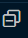

# Become More Productive Course

This course is on freeCodeCamp [channel](https://www.youtube.com/watch?v=heXQnM99oAI), titled: `VS Code Tutorial – Become More Productive`

> Quick overview of what's Vscode


* After we open any activity bar item, we'll see the `sidebar` or it!


* the title of opened file above our editor is called `tab`


* the hierarchy code is called breadcrumbs


* the little code mapping on the right is called the `mini-map`


* and the container of terminal and its siblings is called panels


## hidden stars in Vscode

many of the hidden star stuff in Vscode are in the panels

> 1st essential tool to using Vscode (Command Palette)

With using Command Palette `ctrl + shift + P`, we can hide both status bar and activity bar: by doing:

```sh
>status bar visibility # view: status bar visibility
>activity bar # view: Hide Activity bar
# 🔴These both are great in tutoring🔴
>breadcrumbs # view: toggle breadcrumbs
>tab # toggle tab visibility
```

There are many awesome commands to use rapidly, as `new` which opens options to add new files to current directory, and `git` which appears all sub-commands to git, **and a great one** is: `snippet`, it appears fast fillings `snippets: insert snippet` as when using emmets: check snippet in js files, or even here in md files for example!

## installing themes 15:37

Extensions are critical to unleash productivity in Vscode, check its marketplace [here](https://marketplace.visualstudio.com/vscode), and search for `theme`

although, you can read about themes in Vscode's docs [here](https://code.visualstudio.com/docs/getstarted/themes)

There is a blue background theme similar to what I use called: `Winter is coming theme`. `night owl` is better

but a better way is to use `ctrl + shift + x` for extensions!

open palette then type: `theme`, it'll output themes to use in installed extensions

Download the `material icon theme` to have nice icons in the explorer sidebar

some most popular themes are:

* dark purple:
  * One dark pro
  * Dracula
  * atom one dark

* black average
  * github
  * winter is coming
  * night owl
  * Monokai pro => many good choices `paid`

* purple purple
  * shades of purple

* Yellow blue
  * cobalt2

* popular similar to atom's default and other editors
  * material theme

those are the most popular in 23

---

> less popular themes

1. PaleNight theme
1. SynthWave '84
1. nord (too plain)
1. panda
1. Tokyo night
1. rainglow (liked it)
1. moonlight 2 (good)
1. horizon
1. bearded theme (vivid is good)
1. cyberPunk

## font settings 32:00

Other than adding extensions, changing settings is the second major approach to modify needed experience.

There are two recommended fonts by Chris Sev, which you can download here:

* [Cascadia-code](https://github.com/microsoft/cascadia-code)
* [Fira Code](https://github.com/tonsky/FiraCode)

they're monospaced fonts, traditionally the best for coding he said!

second one has ligatures, which is connecting => to appear as arrows ➡️, and other things as not equals etc...

### change editor's font

access settings `ctrl + ,`, there are two approaches to open settings, `json` and `UI`, simply via palette, `>open settings`

we'll choose ui approach for now, then search for `font family`
then in the edit input, add `'Cascadia Code', ` in the beginning, as css

> Microsoft added 1st font to installed by default in vscode fonts

Installing fonts is as installing system fonts, simply open the files themselves to add them to fonts directory

A paid font `Chris Sev` uses is:

* Operator Mono Lig $175 - $200


He's used `Comic Sans MS`

[This](https://coding-fonts.netlify.app/fonts/codelia/) is a good place to check fonts for coding, they're plenty of good fonts over there!

> I loved `Comic Code` in that site! it's pricy

### other font settings

* font size
* line height
* font ligatures

for line height, to get 1.6 we multiple `tended-height*font-size`, as `1.6*14`

type ligatures in the search bar, it'll ask you to change its value in json file!


there's another good feature for modifying font-size through zooming with the mouse, which is `mouse wheel zoom`, you can activate it from the settings

## Chris Sev's 5 favorite fonts

same page we used for [fonts](https://coding-fonts.netlify.app/fonts/codelia/) include those monospace (same amount of width) fonts:

1. operator mono (paid) $200
1. Cascadia Code (started using it)
1. fira code
1. Inconsolata
1. Anonymous Pro (free)
1. comic code

## Vscode appearance settings

1. Tab size, comes with insert spaces {default: true}
2. rulers {commonly: 80} appears a line to notify us!
3. Render Indent Guides {default: true}, `lines between tabs`
4. word wrap: `alt + z`
5. cursor blinking

the little border-left aside to some settings means that you changed them from their defaults

## Vscode Home base 55:55

### Getting files into Vscode

* dragging the folder directly into the explorer sidebar panel
* Nav options => file => open file || open in the starting window || ctrl + O
* palette => file open

### Creating files && folders |> Explorer

*  to create a folder, click the left one then `newDir/newName` at once! 💌 I said it
* dragging root/file => subDir
*   is when you move files outer the Vscode && return current open file to focus👍
*  to collapse everything

### Context Menu

* 🖱️ right click => `Reveal in File Explorer/FinderForMac` || `ctrl + shift + R`
* ❤️ Open in Integrated Terminal |> I like this and needed it!❤️
* rest are normal, check them out!

### hidden tools

Outline, turns out to be useful! it appears nested objects as breadcrumbs functionality.

We can sync it with our cursor with ... aside it then activating the option `Follow Cursor`

### advanced new file extension

install the second option with its slogan: create files anywhere in your etc...


Then Open the palette `>advanced new file` it's a great tool!

Because it uses fuzzy search similar to autocompletion

> this section included most 2nd important section in vscode

## Where the magic happens

### Vscode's Editor Area

we toggle the side bar with `Ctrl + B`, while explorer opens with `Ctrl + shift + E`

We can click on the breadcrumbs to access their nested code

min-map is draggable as known to me!

We can do side by side as known to me, with two approaches, one to drag the file to the left of the screen, second is to type: `Ctrl + Alt + arrows < / > `
another way is to click on this icon:


we can split the same file to reference another part while editing! good idea

in newer versions we're able to split the screen on top bottom left right, as this:


to convert the split icon to top/bottom `hold alt/option for mac`


splitted screens are called `editor groups`

check this:


we can do the same with the command palette: `>editor split`, or using `2x2` to appear `grid(2x2)` way faster!

we can stop the preview of files, which is the italic naming files, so the file isn't open until you double click on it or modify it! `settings: enable preview`
`workbench > editor:enable preview`

we can customize our opening editor state, not only to remove the welcome landing page, but also changing it with `settings: startup editor`

when we choose `newUntitledFile` option, we can change its extension with clicking on the appeared option, or by using palette with: `>language mode`

if we wanna change the new file to a specific lanauge as md, we use:

```sh
settings: default language # files: default language # markdown # as an eg.
```

If there's a space in the tab, we can open new files by clicking twice aside to latest file's name!

## 14th sec vscode's IntelliSense: The Smartest Helper

> text editors Vs IDE ??

what's the difference between integrated development environment and text editors?

text editors:

```sh
# VScode is a text editor which has many IDEs features
```

IDEs:

```sh
# they have intellisense => 
- code completion
- parameter info
- quick info
- member lists

```

Check vscode's [**intellisense docs**](https://code.visualstudio.com/docs/editor/intellisense)

when using intellisense, we can use context menu => `Go to definition` to to the parent function with Fns


⚠️ Which is the same as what we use, `ctrl/command + right click` ⚠️

### Extra info with JSdoc

in js files, we can initiate docs with `/**` then it'll appear the emmet to `JSdoc comment` as

```js
// when we invoke it above a Fn, it'll automatically bring this param as:

/**
 * @param { string } message
 */
function say(message) {
  alert(message)
}
// That's the way that people explain their packages!
// so, when you hover on a method doc, it'll appear a little hint or whatever developer's type
```

## three ways to search in Vscode

* inline searching: `ctrl/⌘ + f` || `>find` same results
* sidebar => search || `ctrl/⌘ + shift + f`, more powerful => outer Files Capability || explorer => find in folder (I 👍 it)
* `hidden one` |> sidebar => search => `open new search editor`


---

2nd approach we can exclude files and folders in our project scope searching, as putting `components/**` in the exclusion bar. node_modules are already excluded he said.

We can add more patterns into the excluded set in the `settings` => `search exclude`

Third one opens the whole editor's screen to search in, **with more context in the file that it's in**

---

there's another shortcut to `ctrl + shift + L` to multi-cursor a word, which is by clicking `Alt/Option + enter` after focusing on the search box

## Go To

In the context menu, use `Find All References` to get a fast search for needed code

another good one, is: `context menu => rename symbol`, `F2` to change all used names of a key; **❤️it works across multiple files as well ❤️**

## Peek

context menu => `peek => peek definition` it's great when working with multiple files, shorthand to `Alt/option + F12`. **and we can even change the code in the little prompt window**

## 17th Extensions and Customization in VS Code

install/uninstall disable, if you don't know those, you need to learn a lot yet!

But a good one to use is 🔴`disable (workspace)`🔴 to stop not used languages as when working in js and not needing python, or stopping the memory eaters as Snyk for specific projects

We can recommend extensions to other working peers by going to command palette and type: `>Configure recommended Extensions`

Then we can see the folder containing the json file for saving those recommended extensions; to add new extensions to it, we go its page then copy the little tag aside it as:

```sh
esbenp.prettier-vscode

# In my version it only appeared as this in the readme file
# ext install esbenp.prettier-vscode
```

I found another better approach to get the id, which is to click on the little gear aside of any extension then it'll appear the option as `Copy Extension ID`

## settings sync in Vscode

Connect to the little man icon above the gear down in the left corner to sync your data within your (microsoft|github) account!

## Using snippets

double clicking on a blink window, or using `ctrl/cmd + N` Opens a file!

as using for to get for...loop in a language as js, snippets are a big part of Vscode!

to pass to second key of highlighted words, use `Tab`

```js
for (let index = 0; index < array.length; index++) {
  const element = array[index];
  
}
// as to get to array instead of index of this for...loop snippet!
```

we can auto complete appeared snippet using `Tab` as with fo->Tab to get highlighted option

another way is using command palette => `>snippets` insert snippet(to search for needed option)

A powerful approach to use `@category:"snippets"` in the extensions window, to install new snippets

### Creating our own snippets

To create our own snippets, we can go to the command palette again -> `>snippets: configure user snippets` => `New Global Snippets file` for all files || `snippets.code-snippets` for a specific language!

`prefix` is the trigger word to use, as using `for` to get for...loops, `body` is our snipped code, and `$n` is where tab moves through, to give them default values we use this
`${n:tendedCode}` as `${1:arrayToLog}`, view this

```json
{
 "Print to console": {
  "scope": "javascript,typescript",
  "prefix": "log",
  "body": [
   "console.log(${1:arrayName});",
   "$2"
  ],
  "description": "Log output to console"
 }
}
```

This file is created using global snippet palette that we wrote about earlier!

little notice: use `log` snippet to get its snippet instead of `conso => . => log`

## 20: emmet in Vscode

[view:](https://emmet.io), it's great to use as with `!` in html files, even `ul>li.item$*5` is with emmet, check its [**cheat sheet**](https://docs.emmet.io/cheat-sheet/)

There is a sincere crazy in there, check this:

```html
div>h2{hi there}+p{my p body}+button{go Now}
<!-- to get this-->
<div>
  <h2>hi there</h2>
  <p>my p body</p>
  <button>go Now</button>
</div>
```

We can also use emmet with frameworks as vue and react

## $ code `<dir>`

as I know, using `code <path/to/file>` in shell opens up Vscode into that directory, the dir will be in the explore though

If it's not working, install it via the command platte

## HTML&CSS features

### Emmet

A good skelton emmet for html is `html:5` => Tab, same as `!`

We can go to the end of an element using `>go to matching pair` in CMD Palette.

We can rapidly wrap elements with `>wrap with abbreviation` after highlighting which to wrap, as:

```html
<!-- Before -->
<div>
  <h2>hi there</h2>
  <p>my p body</p>
  <button>go Now</button>
</div>
<!-- in its select box, we can use element name as: header even with class/ids as header.mi-amor -->
<!-- after -->
<header>
  <div>
    <h2>hi there</h2>
    <p>my p body</p>
    <button>go Now</button>
  </div>
</header>
```

A good tool to wrap huge html elements is `>balance outward`, instead of searching for the ending tag. use it on top, and it'll highlight it for you, if you use it many times, it'll highlight outward elements -parent els-

### Code folding

Code folding is the left position arrow, > || ˅, its shortcut is `⌥ ⌘[` or `ctrl shift [` to open closed ones back up only change bracket to closing one `]`

### color picker

It's easy and appearing normally in css colors

### CSS Class Definition Hovers

what appears on hovering classes!

#### settings

* Auto Closing Tags
* Linked Editing
* Wrap Attributes

He didn't install any extension to using auto closing tags!
if it's annoying, we can go to the settings then `auto closing tags` then disabling it

to allow Vscode with its built-in features to modify html elements names, without installing exts, go to settings => `linked editing`, using `ctrl/⌘ D` to select it!

to make the html formation cut long attributes into lines, we go to the settings => `wrap attributes` then modifying `HTML > Format: wrap attributes`: `force` instead of auto

### extensions 2:11:40
